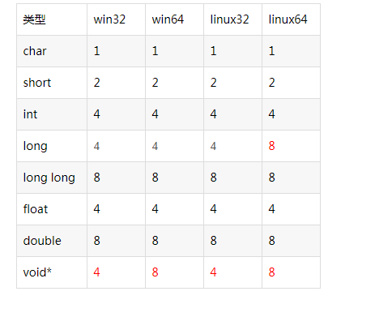

### x++是执行完下一句之后再加,++x是先加1再执行这一句

- According to the declaration: int x=23; the value of expression (x++*1/3) is

`x++`是在这整个表达式执行完之后再加1，所以这个表达式的意思是23*1/3,答案是7

此时如果我们执行`printf("%d\n", (x++*1/3));`的话，输出的是23

!!! note "注意"
    x++是在这整个表达式执行完之后再加1

---

### `-1<=i<1`不是数学表达式

- The following code fragment prints out _____.

```c
for(a=1,i=-1;-1<=i<1;i++)
    { a++; printf(“%2d”,a); }
    printf(“%2d”,i);
```

A．2    B．-1   C．0    D．3

!!! note "编译器警告"
    comparisons like 'X<=Y<=Z' do not have their mathematical meaning,这种表示区间的写法不含有数学意义,但是在逻辑上正确

分析:因为`-1<=i<1`没有数学意义,所以在判断的时候只会先判断-1<=i,然后再判断得到的值是否小于1,因为前一个式子得到的值等于1,所以循环里一个都不会执行,直接输出第10行的内容

---

### 按位运算符

- According to the declaration: `int a`; the value of expression `(a&3)==(a%4)` is :

A. 0    B. 1    C. error    D. uncertained

首先要明白`&`和`%`的含义,`&`是按位与,`%`是取余数

我们a是一个int类型的数字,也就是四个字节,每个字节有8位,也就是2的32次方,也就是32位.

`(a&3)`的意思是取a的最后两位,也就是a这个未被初始化的变量的值和`0000 0011`的二进制取与,得到的是a的最后两位数字

`(a%4)`的意思是取a除以4的余数,(不是位运算),也就是a除以4的商的最后一位,也就是a在二进制下的最后两位数字

那么这两个表达式的结果都是a的最后两位数字,结果相同,也就是1

!!! note 注意
    `&`是按位与,`%`是取余数
    `&3`的效果就是取出最后三位二进制数,`&4`的效果是取出倒数第四位二进制数

---

### 进制,位移运算符,按位运算符

- The following code fragment prints out _____.
`printf("%#o\n", (010<<1^1)&(0xe<<1));`

1. `010`
   - 在 C 语言中，以 `0` 开头的数字是八进制（base 8）数。
   - `010` 是八进制，等于十进制的 `8`：
     - `010`（八进制） = `1 * 8^1 + 0 * 8^0 = 8`（十进制）。

2. `<< 1`(左移一位)
   - 左移操作符 `<<` 会将数字的二进制位向左移动指定的位数。相当于将数字乘以 2 的幂。
   - 对于 `010 << 1`，即对 `8`（`1000` 二进制）左移 1 位：
     - `1000` 左移 1 位变成 `10000`，即十进制的 `16`。

3. `^ 1`（与 1 做异或运算）
   - 异或（`^`）运算符比较两个数的每一位，相同为 `0`，不同为 `1`。
   - 对 `16`（`10000` 二进制）与 `1` 做异或运算：
     - `10000 ^ 1 = 10001`，即十进制的 `17`

4. `0xe`（十六进制数）：
   - `0xe` 是十六进制字面量，`e` 在十六进制中等于十进制的 `14`。
   - 所以 `0xe` 就是十进制的 `14`，即二进制的 `1110`。

5. `<< 1`（再次左移 1 位）：
   - 对 `0xe`（即 `14`，`1110` 二进制）左移 1 位：
     - `1110` 左移 1 位变成 `11100`，即十进制的 `28`。

6. `&`（按位与运算）：
   - 按位与运算符 `&` 会将两个数的二进制位逐位比较，当两个数的对应位都为 `1` 时结果为 `1`，否则为 `0`。
   - 对 `17`（`10001` 二进制）和 `28`（`11100` 二进制）做按位与：
     - `10001 & 11100 = 10000`，即十进制的 `16`。

7. `%#o`（输出八进制并加上前导 `0`）
   - `%o` 格式化符号会把数字输出为八进制格式。
   - `#` 修饰符会在八进制数前加上 `0` 前缀。
   - 所以，十进制的 `16` 转换为八进制是 `20`。

!!! note 注意
    `<<` 是左移操作符，`^` 是异或操作符，`&` 是按位与操作符。
    `#o` 修饰符会在八进制数前加上 `0` 前缀。
    0x 表示十六进制数，0 表示八进制数。

```c
#include <stdio.h>
int main(){
    printf("%#o\n", (010<<1^1)&(0xe<<1));
    printf("%#o\n", (010));
    printf("%#o\n", (010<<1));
    printf("%#o\n", (0xe<<1));
    printf("%#o\n", (010<<1^1)&(0xe<<1));
} 
```

```bash
020
010
020
034
020
```

---

### 命令行参数`argv`和`argc`,约定俗成的两个变量

- To execute the command: prog at my home, the value of *(*(argv+2)+1) is___.

main其实是这样

```c
int main(int argc, char *argv[]) {
    // ...
}
```

然后把那句话在命令行中输入.argv+2指向my这个数组.`*(argv+2)`指向my的地址,也就是m这个字符.然后加1指向了y.然后再*取出y

所以答案是y

---

### ==和=的区别

- The following code fragment outputs the string str. The loop condition `str[i]!='\0'` can be replaced by _______.

```c
char str[80]=”hello, world”;
for (i = 0; str[i] != ‘\0’; i++)
putchar(str[i]);
```

A．`str[i]`   B．`i < 80`   C．`!(str[i] = ‘\0’)`   D．`i <= 80`

分析:

A. `str[i]：`
这个条件在 str[i] 为非零值（即非 \0）时为真，因此可以替代 str[i] != '\0'。
正确。

B. `i < 80：`
这个条件会遍历整个数组 str，即使字符串的实际长度小于 80。这会导致不必要的遍历，甚至可能访问到未初始化的内存。
不正确。

C. `!(str[i] = '\0')：`
这个条件实际上是将 `str[i]` 赋值为 \0，然后检查赋值后的值是否为假（即 \0）。这会导致字符串被截断，且逻辑错误。
不正确。

D. `i <= 80：`
这个条件会导致数组越界，因为 str 的最大索引是 79。
不正确。

C比较容易看错吧,注意分辨`==`和`=`的区别

---

### 数组定义时a是一个常量指针不能被修改,指向第一个元素

- With regard to the array definition “int a[4]; “，which expression in the follows is wrong _______?
A．*a    B．a[0]    C．a    D．a++

我们数组定义的时候a就是一个指针,指向的是数组的第一个元素,但是这也是一个常量指针,不能被修改,所以D错误

并且`a`是数组的首地址，类型是 `int*`，这是合法的

---

### 二维数组第二个参数不能少

- The following statements have defined different arrays. Which statement is wrong _______?
A．`int a[1][3]`;    B．`int x[2][2]={1,2,3,4};`
C．`int x[2][]={1,2,4,6};`    D.`int m[][3]={1,2,3,4,5,6};`

二维数组第一个表示的是有几行,第二个表示的是有几列

也就是第一个表示的是有几个一维数组,第二个表示的是这个一维数组有几个元素

如果第二个参数没有确定的话,整个二维数组就无法构建,因为第一个一维数组结束后就是第二个的开头,需要第二个参数来确定

!!! note 注意
    二维数组第二个参数不能少

---

### '\0'的ASCII码 && 注意case没有break的时候会顺延执行下一个case直到遇到break

- The following code fragment prints out:

```c
char x='\0',y='1';
switch(!x) {
    case 0: printf("*0*#");break;
    case 1:
    switch(y){
        case '0': printf("*1*#");break;
        case '1': printf("*2*#");break;
    }
    default: printf("*3*#");
}
```

逐行分析:

- `char x='\0',y='1';`赋值
  - `x` 赋值为 `'\0'`，即十进制的 `0`。
  - `y` 赋值为 `'1'`，即十进制的 `1`。
- `switch(!x) {` 执行判断选择
  - `!x` 结果为 `1`，所以执行 `case 1:`。
- `case 1:` 执行 `switch(y){`
  - `y` 结果为 `'1'`，所以执行 `case '1': printf("*2*#");break;`。跳出的是里面的 `switch` 语句。

- 因为case 1执行完了,所以不会再执行case 0,所以不会输出*0*#,但是case1没有break,执行了default,输出*3*#.

- `default: printf("*3*#");` 执行
  - 输出 `*3*#`。

所以输出结果为 `*2*#3*#`

---

### '\0'

The value of expression  `sizeof(“%%hello\nworld\n”)`is______.

考点:'\0'在sizeof中计入长度

!!! note 注意
    - sizeof 运算符返回变量或类型在内存中所占的字节数。
    对于字符串，sizeof 运算符返回字符串的长度加 1（以 '\0' 结尾）。
    - strlen 函数返回字符串的长度，不包括 '\0'。

---

### 静态变量

- The following program prints out _____.

```c
# include <stdio.h>
int f(int m)                      
{   
static int k=0; 
        int s=0;            
        for(; k<=m; k++) s++;
        return s;
}
void main( )
{  
int s=1;
s=f(4);
        printf("%d#%d#", s, f(2));
}
```

`static int k=0;`是静态变量,只会初始化一次,所以第一次调用的时候k是0,第二次调用的时候k是4,所以s=4,f(2)的时候k还是4,此时s=0,没有进入for循环

!!! note 注意
    静态变量只会初始化一次,生命周期是整个程序.静态变量的生命周期从程序开始运行时创建，到程序结束时销毁。**即使变量在函数内部声明，它也不会在函数调用结束后被销毁，而是会一直保留其值。**

---

- The following program prints out _____.

```c
#include <stdio.h>
void main( )
{
    int i=0, n;
    char s[10]="298h01";
    n=0;
    for(i=0; s[i]!='\0'; i++)
        if(s[i]<='9'&&s[i]>='0') 
               n=n*10+(s[i]-'0');
        else
            break; 
    printf("%d\n", n);
}
```

这个不要把`h`计入了,注意到前面的判断(我好蠢)

如果要计入的话,注意0的ASCII码是48,9的ASCII码是57

A的ASCII码是65,a的ASCII码是97

---

### 使用typeof定义一个指针型的函数

Use `typedef` to define a pointer type that points to a function returning float type

答案:`typedef float (*fp)();`

使用 `typedef` 定义一个指针类型，指向一个返回 `float` 类型的函数。

```c
typedef float (*fp)();
```

拓展:

1. 使用typeof定义一个返回int类型的函数,其中这个函数会接受一个int类型的参数

`typedef int (*int_func)(int);`

2. 使用typedef定义一个结构体,其中包含一个指向函数的指针

```c
typedef struct {
    int (*func)(int);
} my_struct;
```

这个结构体包含一个指向函数的指针，指向的函数的返回值是 `int`。

>9.	已知一个函数指针类型\，它所指的函数返回值类型为空类型，接收两个参数：一个是字符指针类型，一个是整型。请用typedef将该函数指针类型命名为FunType，具体形式为：_________.

`typeof void (*FunType)(char*, int);`

结构:`typeof 返回类型 (*指针名)(参数类型1, 参数类型2, ...);`

---

### 二维数组的指针`a[i]`指向 第i行的第一个元素,不是第i个元素

-For the following array a, the value of *(a[1]+1) is  _____.
`int a[3][2]={1,2,3,4,5,6};`

A. 3    B. 4    C. 5    D. 6

分析:

- `a[1]` 是一个指针，指向数组 `a` 的第二行的第一个元素。
- `*(a[1]+1)` 是一个指针，指向数组 `a` 的第二行的第二个元素。
- 也就是 `4`。

---

### `scanf("%s",s)`会读取输入的第一个单词,以空格或换行符分隔

- When input : `How Are You?`ENTER, the output of the following program is_____.

```c
#include <stdio.h>
void main()
{
char s[80];
int i=0;
scanf("%s",s);
while(s[i]!='\0') {
if(s[i]>='a'&& s[i]<='v') s[i] += 4;
else if(s[i]>='w'&& s[i]<='z') s[i] -= 22;
        i++;
}
puts(s);
}
```

!!! note 注意
    scanf("%s", s);
    scanf 会读取输入的第一个单词（以空格或换行符分隔），因此 s 的内容为 "How"。

s 的值为：{'H', 'o', 'w', '\0'}。

所以输出

```bash
Hsa
```

---

### 注意函数中不仅有返回值,遇到printf也会输出

```c
#include <stdio.h>
    int z;
    void p(int *x,int y)
{ 
++ *x;
  y --;
  z = *x+y;
      printf("%d,%d,%d#",*x, y, z);
}
void main()
{ 
int x=1, y=2, z=3;
      p(&y, x);
      printf("%d,%d,%d#",x, y, z);
}
```

!!! warning 注意
    注意函数里面的printf

---

### `#define`直接展开,和前面的容易产生优先级的错误

```c
#include <stdio.h>
    #define F(k)        k+3
    #define P(a)      printf("a=%d#", (int)(a))
    #define P1(a)       P(a);putchar('#');
    #define P2(a, b)     P(a);P1(b);
    void main()  
    {
        int x = 1;
        {
            int x = 2;
            P(x*F(2));
        }
        {
            for (; x < 10; x += 50)
                P2(x, 9*x+32);
       }
}
```

`#define F(k)        k+3`是直接展开的,变成了`2*k+3`

`P2(x, 9*x+32)`在x=1的时候,进入循环被执行,然后调用#define P2(a, b) P(a);P1(b);,展开后为`P(1);P1(9*1+32);`

注意到此时for没有括号,所以只能保住一个`P(1)`

在下个`P2(x*9+32)`的时候就已经变成了50.

`P2`展开后为`P(1);P(9*1+32);P('#');`

之后带入计算就好了

---

### `\101`是八进制数,对应的ASCII码是65,也就是A

`zju\101\\TED`占几个字节?

1. **`z`**：普通字符，占 1 个字节。
2. **`j`**：普通字符，占 1 个字节。
3. **`u`**：普通字符，占 1 个字节。
4. **`\101`**：转义字符，表示八进制数 `101` 对应的 ASCII 字符。
   - 八进制 `101` 转换为十进制是 `65`，对应 ASCII 字符 `'A'`。
   - 占 1 个字节。
5. **`\\`**：转义字符，表示反斜杠 `\`。
   - 占 1 个字节。
6. **`T`**：普通字符，占 1 个字节。
7. **`E`**：普通字符，占 1 个字节。
8. **`D`**：普通字符，占 1 个字节。

```text
z | j | u | \101 | \\ | T | E | D
```

- `strlen` 计算字符串的长度，不包括末尾的空字符 `\0`。
- 因此，`strlen("zju\101\\TED")` 的结果是 **8**。

```c
#include <stdio.h>
#include <string.h>

int main() {
    printf("%d", strlen("zju\101\\TED")); // 输出: 8
    return 0;
}
```

!!! warning
    注意转义字符的使用,`\101`是八进制数,对应的ASCII码是65,也就是A,代表的是一个字节

>在 C 语言中，八进制转义序列的格式为：`\ooo`，其中 `ooo` 是 1 到 3 位的八进制数字。

| 八进制转义序列 | 十进制值 | ASCII 字符 |
|----------------|----------|------------|
| `'\0'`         | 0        | 空字符     |
| `'\12'`        | 10       | 换行符     |
| `'\40'`        | 32       | 空格       |
| `'\101'`       | 65       | A          |
| `'\141'`       | 97       | a          |

- 八进制转义序列的长度最多为 3 位，且每位数字必须在 `0` 到 `7` 之间。
- 如果八进制数字超过 3 位，只有前 3 位会被解释为转义序列，后面的字符会被当作普通字符处理。

```c
  char c = '\1012'; // 实际解释为 '\101' + '2'，即 'A' + '2'
  printf("%c\n", c); // 输出：A2
```

---

### 转义字符`\`单独出现不合法

在 C 语言（以及其他许多编程语言）中，反斜杠 `\` 是一个**转义字符**，用于表示特殊字符或具有特殊含义的字符序列。

| 转义序列 | 含义                          |
|----------|-------------------------------|
| `\\`     | 表示一个反斜杠 `\`            |
| `\'`     | 表示单引号 `'`                |
| `\"`     | 表示双引号 `"`                |
| `\n`     | 表示换行符（Newline）         |
| `\t`     | 表示水平制表符（Tab）         |
| `\r`     | 表示回车符（Carriage Return） |
| `\b`     | 表示退格符（Backspace）       |
| `\f`     | 表示换页符（Form Feed）       |
| `\a`     | 表示响铃符（Alert/Bell）      |
| `\0`     | 表示空字符（Null）            |
| `\xhh`   | 表示十六进制值的字符          |
| `\ooo`   | 表示八进制值的字符            |

- 单独出现的时候编译时会报错，例如：`error: stray '\' in program`。
- 如果需要在字符串或字符常量中表示一个反斜杠 `\`，必须使用转义序列 `\\`。
- 如果需要在字符串中表示其他特殊字符（如换行符、制表符等），也需要使用相应的转义序列。

```c
#include <stdio.h>

int main() {
    printf("这是一个反斜杠: \\\n"); // 输出：这是一个反斜杠: \
    printf("这是一个换行符: \n");   // 输出：这是一个换行符: （并换行）
    printf("这是一个制表符: \t");   // 输出：这是一个制表符: （并插入制表符）
    return 0;
}
```

- **单独使用 `\`**：
  ```c
  printf("\"); // 错误
  ```
- **未闭合的转义序列**：
  ```c
  printf("\x"); // 错误：\x 需要跟随十六进制数字
  ```
- **无效的转义序列**：
  ```c
  printf("\z"); // 错误：\z 不是有效的转义序列
  ```

- `\` 是转义字符，用于表示特殊字符或字符序列。
- 单独出现 `\` 是**不合法的**，必须与有效的转义序列一起使用。
- 如果需要表示反斜杠 `\`，必须使用 `\\`。
- 转义字符在字符串和字符常量中非常常见，用于处理特殊字符或格式化输出。

---

### 判断函数的意思再做题

The output of the following program is _______.

```c
#include <stdio.h>
#include <stdio.h>
void p1(int v[])
{ int i,j,temp;
  for (i=1; i<5; i++)
  for(j=i-1; j>=0&&v[j]<v[j+1]; j--)
    temp = v[j], v[j]=v[j+1], v[j+1]=temp;
}
void p2(int v1[], int v2[])
{ int i=0, j=0;
  while (i<5 && j<5)
    if (v1[i]>v2[j]) printf("%d ", v1[i++]);
    else  printf("%d ", v2[j++]);
  while (i<5) printf("%d ", v1[i++]);
  while (j<5) printf("%d ", v2[j++]);
}
void main()
{
  int i,j;
  int a[2][5]={{5,3,7,2,1},{4,0,8,9,6}};
  p1(a[0]);
  p1(a[1]);
  p2(a[0],a[1]);
}
```

先判断函数的意思是什么,再写,不要上来就编译,人不是编译器

---

### fgets()函数用来逐行查找字符,返回指针

fgets() 函数的作用是从一个流中读取一行字符串，并存入一个缓冲区中。没成功读取就返回NULL。

可以用来逐行查找文件

```c
while(fgets(line, sizeof(line), fp)!= NULL){
    /**/
}
```

---

### 命令行参数`argv`和`argc`(前面写过一点)

命令行参数的第一个参数是程序名，后面的参数是命令行参数。

```c
#include <stdio.h>

int main(int argc, char *argv[]) {
    /* code */
    return 0;
}
```

这个时候,就算没有scanf这些输入输出函数,也可以用argv来处理命令行参数了

- 如果不写 argc 和 argv，程序默认无法访问命令行参数。

- 如果需要处理命令行参数，必须将 main 函数定义为 int main(int argc, char *argv[])。

- argc 和 argv 是 C 语言中处理命令行参数的标准方式。一般约定俗成,代码可维护性高,不推荐改成别的名称(虽然可以改)

---

### 与的优先级比或高

`&`的优先级比`||`高,所以`(x<=a)||(x>=b)&&(x<=c)`
表达式会被解析为：
`(x <= a) || ((x >= b) && (x <= c))`

---

### 数组的指针和指针的数组

**`int *p[3];`和`int (*p)[3]`有什么区别**

`int *p[3]`是定义了一个长度为 3 的数组，数组的每个元素都是 `int*` 类型的指针。

`int (*p)[3]`是定义了一个指向长度为 3 的数组的指针，该指针指向 `int[3]` 类型的数组。

ps:`int **p;`则是一个指向指针的指针，指向一个 `int` 类型的指针

---

### ++p和p++的区别

`for ( ; sp++ <= sq--; ) *sp = *sq;`
执行到**`*sp = *sq`**时，`sp`和`sq`的都完成了自加和自减操作，所以`*sp = *sq`是`*sp = *(sq - 1)`。

不是当时的比较值.

---

### 字符串没填满数组时sizeof的输出是数组的长度

```c
#include <stdio.h>
#include<string.h>

int main()
{
    int i;  char s[80]={"apple\0grape\0pear\0coco\0"};
	for(i=0; i<2; i++) s[strlen(s)] = '\n';
	printf("%d#%d\n",strlen(s),sizeof(s) );
	
}
```

sizeof输出的是数组的长度,也就是80

```C
#include <stdio.h>
#include<string.h>

int main()
{
    int i;  char s[]={"apple\0grape\0pear\0coco\0"};
	for(i=0; i<2; i++) s[strlen(s)] = '\n';
	printf("%d#%d\n",strlen(s),sizeof(s) );
	
}
```

这里输出的是s的长度,所以\0也会被计入,并且最后还有一个'\0',所以是23个字符

---

### long的大小

```C
#include <stdio.h>
#include<string.h>
int f(long a[])                      
{   
    return (int)sizeof(a);
}
void main()
{   
    long a[][3] = {1,2,3,4},*p;
printf("%d#%d\n",sizeof(a),f(a[0]));
    printf("%d %d %d",sizeof(long),sizeof(int),sizeof(short));
}
```

`f()`传入一个`long`类型的数组,返回a的大小,并且转换成int类型



---

### **全局变量未指明默认赋值为1**,

```c
#include <stdio.h>
#include<string.h>

int x,y=1;
int func( int *x, int y, int *z )
{    
	printf("%d ",*x); 
	  y += 2;  *z = *x+y; 
     return y;
 }
void main()
{    
     int z; 
     x = func(&x, y, &z);  
     printf("%d#%d#%d", x, y, z); 
}
```

---

### 局部变量

注意在函数中的局部变量在函数结束之后会被释放掉,所以在函数中不能再使用之前的局部变量,只能使用函数中的局部变量

---

### `while(k-->0)`的不是赋值也不是word敲错了,是表示判断k>0然后自减

```c
 while( k-->0)
      printf("%c", d[k]<10?'0'+d[k]:  'A'+d[k]-10);
   return 0;
```

这个`while(k-->0)`的意思是k--直到k小于0,然后打印d[k]的值,如果d[k]小于10,则打印'0'+d[k],如果d[k]大于等于10,则打印'A'+d[k]-10,也就是将10进制的数转化为16进制的数,不是赋值

---

### `int* p[]`表示这个数组存储的是地址,并且是指针类型的地址,可以`p[k][m]`直接访问`a[k]`后面的第m个元素

```c
#include <stdio.h>
int matrixTrace(int* m[],int n)
{
   int tr, k;
   for(tr=k=0; k<n; k++){
      tr += m[k][k];
      printf("%d\n",*m[k]);
      printf("%d\n",m[k][k]);
   }
   return tr;
}

int main()
{
   int a[100],*m[10], k;
   for( k=0; k<100; k++)  a[k]= k;
   for( k=0; k<5; k++)  m[k]= a +5*k;
   printf("%d",matrixTrace(m,5));
   return 0;
}
```

我们来逐行解释这个程序:

- 首先定义了一个函数`matrixTrace(int* m[],int n)`，这个函数的作用是计算矩阵的迹。
- 然后定义了一个`main()`函数，这个函数的作用是初始化矩阵，并调用`matrixTrace()`函数。
- 然后初始化了一个`int`型数组`a`和`int`型指针数组`m`
- 然后用`for`循环初始化`a`数组，并用`for`循环初始化`m`数组，`m[k]`指向`a`数组的第`5*k`个元素。也就是`m[k]`存储的是`a[0]`到`a[5*k]`的地址.
- 然后调用`matrixTrace()`函数，并传入`m`和`5`作为参数。
- `m[k][k]`的意思是`m[k]`指向的数组的`a[5*k]`之后第k个元素的值。
- 然后计算`m[k][k]`的和，并返回。
- 最后打印出`matrixTrace()`函数的返回值。

!!! note 注意
    当`m[k]` 是一个指针，指向数组 a 中的某个位置。`m[k][k]` 是对指针 `m[k]` 进行下标访问，相当于 `*(m[k] + k)`

---

### 注意题目的小细节,`c[i] = b[2*i];`

```c
#include <stdio.h>
void fun(int* a[],int n,int m)
{  
    int i,j,x;
    for(i=0;i<n;i++) {
	  x=*a[i];//把a[i]的值赋值给x 
	  for(j=1;j<m;j++)
	       if(*(a[i]+j)>x)    x=*(a[i]+j);//如果a[i+j]的值大于x,那么把*(a[i]+j)赋值给x ,a[i]之后有一个大于a[i],x
	       //就变成最大的那个 
		    printf("%d\n",x); 
	  for(j=0;j<m;j++)
	    *(a[i]+j)+=x;
	    //然后再把每一个值加上x 
    }
}

int main()
{
    int b[][3]={{1,2,3},{4,5,6},{7,8,9},{10,11,12}};
    int i,j, *c[2];
    for(i=0;i<2;i++) c[i]=b[2*i];//c[0] = &b[0] = &{1,2,3},c[1] = &b[2] = &{7,8,9};
    fun(c,2,3);//给如c[0]的地址,并且n=2,m=3
	// x=1,===x=3 i = 0
	// {4,5,6}
	//i = 1;
	// x = 4;
	// {10,11,12} 
	 
    for(i=0;i<2;i++){
         for(j=0;j<3;j++) 
		 	printf("%d ",*(c[i]+j)); //4 5 6 ##16 17 18 ##
	    printf("##");
   }
   return 0;
}
```

---

### 浮点数取特定位数

```c
printf("%.2f");
```

都是四舍五入进位的,和转int不一样,转int是直接切掉小数部分取整数部分

---

- 设char s[]="ABC ABC"; 则strcmp(s, s+4)的值为_________. 

`strcmp(s, s+4)`的作用是比较两个字符串的大小，返回值为两个字符串的 ASCII 码差值。

`int strcmp(const char *str1, const char *str2);`返回值 < 0：str1 小于 str2（按字典顺序）。

返回值 = 0：str1 等于 str2。

返回值 > 0：str1 大于 str2（按字典顺序）

strcmp 会逐个字符比较 str1 和 str2，直到遇到不同的字符或字符串结束符 \0。比较是基于字符的 ASCII 值进行的。


1. **字符串 `s` 的内容**：
   - `s` 是一个字符数组，内容为 `"ABC ABC"`。
   - 在内存中，`s` 的存储形式为：`{'A', 'B', 'C', ' ', 'A', 'B', 'C', '\0'}`。

2. **`s+4` 的含义**：
   - `s` 是数组的首地址，`s+4` 表示从 `s` 的第 4 个字符开始的字符串。
   - `s+4` 指向的内容是 `"ABC"`（从第 4 个字符 `'A'` 开始，到字符串结束符 `'\0'`）。

3. **`strcmp(s, s+4)` 的比较**：
   - `strcmp` 会逐个字符比较两个字符串，直到遇到不同的字符或字符串结束符 `\0`。
   - 比较过程如下：
     - `s` 的第一个字符是 `'A'`，`s+4` 的第一个字符也是 `'A'`，相等，继续比较。
     - `s` 的第二个字符是 `'B'`，`s+4` 的第二个字符也是 `'B'`，相等，继续比较。
     - `s` 的第三个字符是 `'C'`，`s+4` 的第三个字符也是 `'C'`，相等，继续比较。
     - `s` 的第四个字符是 `' '`（空格），`s+4` 的第四个字符是 `'\0'`（字符串结束符）。
     - 空格字符 `' '` 的 ASCII 值是 32，而 `'\0'` 的 ASCII 值是 0。
     - 因为 `' '` 的 ASCII 值大于 `'\0'`，所以 `strcmp(s, s+4)` 返回一个正数。

---

`int *p[3];`

是一个 指针数组，表示 `p` 是一个包含 3 个 `int*` 指针的数组。

适用于存储多个指针的场景。

`int (*p)[3];`

是一个 数组指针，表示 p 是一个指针，指向一个包含 3 个整数的数组。

需要`(*p)[i]`来访问数组的元素


| 特性                | `int *p[3];`（指针数组）               | `int (*p)[3];`（数组指针）               |
|---------------------|---------------------------------------|-----------------------------------------|
| **类型**            | 数组，每个元素是一个 `int*` 指针       | 指针，指向一个包含 3 个 `int` 的数组     |
| **内存布局**        | 数组中有 3 个指针                     | 指针指向一个数组                        |
| **适用场景**        | 存储多个指针，例如动态分配的数组       | 指向二维数组的行                        |
| **示例**            | `int *p[3] = {&a, &b, &c};`           | `int (*p)[3] = arr;`                    |
| **访问方式**        | `*p[0]`, `*p[1]`, `*p[2]`             | `(*p)[0]`, `(*p)[1]`, `(*p)[2]`         |

设有定义`int a[3][3]={{1,2,3},{4,5,6},{7,8,9}};` 现要使`p=a`;则`p`的定义必须为_________. 
A．`int p[3][3];`	B．`int *p[3];`	C．`int (*p)[3];`	D．`int **p;`

答案：C, 因为`p`是一个指向数组的指针，指向一个包含 3 个整数的数组。所以用`(*p)[3]`的方式来定义

---

### 运算顺序

先加减,后按位计算,最后再与或非

!!! note
    但是按照位取反的优先级很高,和sizeof一样

主要的几个档次

1. 数组下标`[]`,`()`,`.`,`->`和后置的自增自减`++` `--`
2. 前置的自增自减,负号运算符号`-`,类型转换`()`,地址解码`*`,取地址`&`,逻辑`!`非,和取反`~`
3. 乘除取模
4. 加减
5. 左移右移`>>`,`<<`
6. 关系判断,`<`,`>`,`<=`,`>=`,
7. `!=`和`==`
8. 按位与`&`
9. 按位异或`^`
10. 按位或`|`
11. 逻辑与`&&`
12. 逻辑或`||`
13. 条件运算符`?:`
14. 赋值系列:`=,+=,-=,*=,/=,%=,&=,^=,|=,<<=,>>=`
15. 逗号`,`

---

```c
#include <stdio.h>

int main() {
    char p[3][4]={"ABC", "DEF", "XYZ"}; 
	char *q[3]; q[0]=p[0]; q[1]=p[1]; q[2]=p[2];
    *(*(q+1)-1) = *p[2];
	puts(*p);
	

    return 0;
}
```

每一个地方都是陷阱

为什么定义成`char p[3][4]={"ABC", "DEF", "XYZ"};` 而不是`char p[3][3]={"ABC", "DEF", "XYZ"};`

因为字符串是以`\0`结尾的,所以要多一个位置

所以`*(*(q+1)-1) = *p[2];`被赋值的是'\0`

所以`puts(*p);`输出的是`ABCXDEF`

---

### 静态全局变量和外部变量

```c
// file1.c
int x;
```

```c
// file2.c
extern int x; // 声明在file1.c中定义的变量x，而不是重新定义
static int y; // 定义仅在file2.c中使用的变量y

```

用extern表示外部变量

### 动态内存申请

malloc函数用于动态分配内存，其原型为：

```c
void *malloc(size_t size);
```

该函数返回一个指针，指向分配的内存块的起始地址。如果分配失败，则返回NULL。

free函数用于释放由malloc函数分配的内存，其原型为：

```c
void free(void *ptr);
```

该函数释放由ptr指向的内存块。

```c
#include <stdio.h>
#include <stdlib.h>

int main() {
    int *p;
    p = (int*)malloc(10 * sizeof(int)); // 申请10个int的内存
    if (p == NULL) {
        printf("Memory allocation failed.\n");
        return 1;
    }
    // 使用p指向的内存
    // ...
    free(p); // 释放内存
    return 0;
}
```

---

注意switch语句的使用,注意break是跳出哪一条语句的,不是有一个break就认为都能跳出不会直接执行了

---

若定义`static int a[3][4]={{1,2,3},{4,5,6}}`，则表达式`a[2][-1]+ a[1][1]`的值是_________.

注意啊,数组static没定义也是0,不是随机数

---

short类型的变量占2个字节,所以`sizeof(short)`是2

long类型的变量占4个字节,所以`sizeof(long)`是4

int类型的变量占4个字节,所以`sizeof(int)`是4

double类型的变量占8个字节,所以`sizeof(double)`是8

float类型的变量占4个字节,所以`sizeof(float)`是4

!!! warning
    float类型的变量占4个字节，double类型的变量占8个字节。

>若定义short a[4]={11, 22, 33, 44}; ，则表达式 (int)&a[3] – (int)&a[0]的值是_________

三个2,答案是6

---

*p++,先解码再++,自增的也是p指向下一个地址

*++p,先++再解码,先指向下一个地址在解码

---

```c
#include <stdio.h>
int s;//全局变量s=0
int f(int m)                      
{   
    static int k=0; //静态变量,在全局存在,只定义一次
    for(; k<=m; ++k) s++;//循环一次s++;k=0到k=m,循环了m+1次
    return s;//返回了s+m+1;出来的时候k=m;
}
int main()
{   
	int s=1;//这个在main函数中的是局部变量
	s=f(2)+f(1);	//f(2)返回的s=0+3=3,此时k=2,f(1)返回的s=3+2=5,此时k=2(没有进入for循环),直接返回
    printf("%d#%d#", s, f(3));//s=6,f(3)返回的s++,这个s是全局变量,所以s=4;
    return 0;
}
```

- **第一次调用 `f(2)`**：
  - `k` 初始为 0，`m` 为 2。
  - 循环条件 `k <= m`，循环 3 次（`k = 0, 1, 2`）。
  - 每次循环 `s` 自增 1，`s` 从 0 变为 3。
  - 返回 `s = 3`。
  - 此时 `k = 3`（因为 `++k` 在最后一次循环后执行）。

- **第二次调用 `f(1)`**：
  - `k` 的值为 3，`m` 为 1。
  - 循环条件 `k <= m` 不成立，循环不执行。
  - 返回 `s = 3`（`s` 没有变化）。

  - `s = f(2) + f(1) = 3 + 3 = 6`。

- **调用 `f(3)`**：
  - `k` 的值为 3，`m` 为 3。
  - 循环条件 `k <= m`，循环 1 次（`k = 3`）。
  - `s` 自增 1，`s` 从 3 变为 4。
  - 返回 `s = 4`。

  - `s = 6`（局部变量）。
  - `f(3) = 4`。
  - 输出结果为 `6#4#`。

```bash
6#4#
```

- 全局变量 `s` 在函数 `f` 中被修改。
- 静态变量 `k` 保留了上一次调用的值。
- 局部变量 `s` 在 `main` 函数中与全局变量 `s` 同名，但作用域不同。
- 最终输出结果为 `6#4#`。

!!!
    注意全局变量和局部变量的作用域,重名的话以局部为准,看看有没有哪个函数被命名了两次的

---

结构体:

```c
struct ListNode *readlist() {
    struct ListNode *head = NULL;
    struct ListNode *tail = NULL;
    int num;

    scanf("%d", &num);
    while (num != -1) { // 输入结束标记是 -1
        struct ListNode *new_node = (struct ListNode *)malloc(sizeof(struct ListNode));
        new_node->data = num;
        new_node->next = NULL;

        if (head == NULL) {
            head = new_node;
            tail = new_node;
        } else {
            tail->next = new_node;
            tail = new_node;
        }
        scanf("%d", &num);
    }

    return head;
}
struct ListNode *deletem( struct ListNode *L, int m ){
    struct ListNode *head = NULL;
    head = L;
    while(1){
        if(L->next == NULL){
            break;
        }
        if(head->data == m){
            head = (L->next);
        }
        if((L->next)->data == m ){
            L->next = ((L->next)->next);
        }else{
            L = L->next;
        }
    }
    if(L->data == m){
        return NULL;
    }

    return head;
}
```


