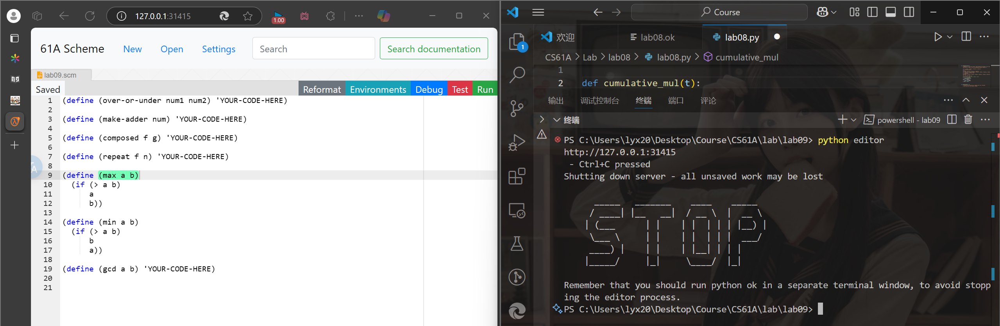

## 目标

学习基本的Scheme语法,完成CS61A的hw和lab

## 安装MIT-Scheme

面相windows用户的教程

在windows系统上有很多免费的scheme实现,在本次学习中我们使用MIT-Scheme

因为MIT-Scheme非常高效并且容易安装,解释器非常快速,还能将程序编译为本地代码

这里使用wsl安装,因为在官网上已经没有了windows的安装包

```bash
sudo apt-get install mit-scheme
```

之后输入`mit-scheme`即可进入scheme的交互式环境

## 在CS61A中使用Scheme完成作业

61A的scheme解释器包含在scheme作业中,在终端中键入`python scheme`启动

要加载f.scm的Scheme文件,可以键入`python scheme -i f.scm`

要退出解释器,可以键入`(exit)`

### scheme编辑器

所有的scheme作业都是基于一个web编辑器可以轻松运行OK测试和可视化环境

在终端键入`python editor`即可启动编辑器

用`ctrl+c`退出



## 将Scheme用作计算器

```scheme
(+ 137 349)
```

这个表达式的值是486

```scheme
;Value: 486
```

一对括号代表了一次计算的步骤,左括号紧跟一个函数的名字,然后是参数

在scheme中大多数的操作符都是参数

这里的函数是`+`,它的参数是`137`和`349`

标记的分隔符是空格(SPACE),制表符(TAB),换行符(NEWLINE),逗号和分号不是分隔符

**求值过程**:符号`+`被求值为加法过程,在前端输入`+`,解释器会返回`;Value: #[arity-dispatched-procedure 12]`,这说明`+`是一个过程

然后对`137`和`349`求值,这两个数值被求值为它们自己

最后,求值`+`过程,这个过程将`137`和`349`相加,得到`486`并且跳出括号

在scheme中,求得的值会跳出括号外,并且在这个值会被打印到前端

函数`+`可以接受任意多的参数,例如

```scheme
(+ 10 20 30 40)
```

### 基本算术操作

函数`exact->inexact` 用于把分数转换为浮点数。Scheme也可以处理复数。复数是形如a+bi的数，此处a称为实部，b称为虚部。+、-、*和/分别代表加、减、乘、除。这些函数都接受任意多的参数

注意

```scheme
1 ]=> (/ 29 3)

;Value: 29/3

1 ]=> (/ 29 3 7)

;Value: 29/21
```

这些由括号,标记(token)和分隔符组成的式子,被称为S-表达式

其他计算,`quotient`是整数除法,`remainder`是取余数,`sqrt`用于求平方根

```scheme
(quotient 7 3) ;→ 2
(modulo 7 3)   ;→ 1
(sqrt 8)       ;→ 2.8284271247461903
```

三角函数

atan接受1个或2个参数。如果atan的参数为1/2 π,那么就要使用两个参数来计算。

```scheme
(atan 1) ;→ 0.7853981633974483
(atan 1 0) ;→ 0.7853981633974483
```

sin,cos,tan都可以正常使用

对数和指数函数:指数函数exp,对数函数log,log10

```scheme
(exp 1) ;→ 2.718281828459045
(log 2.718281828459045) ;→ 1.0
(log10 1000) ;→ 3.0
(expt a b) ;→ a^b
```

## 函数

`define`用于定义函数

```scheme
(define (square x) (* x x))
```

```scheme
(define pi (+ 3 0.14159))
(define radius 10)
```

`if`语句

```scheme
(if <predicate> <if-true> <if-false>)
```

```scheme
(if (> 10 20) 20 10)
```

>Python if 语句的套件中可以添加更多代码行，而 Scheme if 表达式在 `<if-true>` 和 `<if-false>` 位置中的每个位置都只需要一个表达式

`cond`语句

```scheme
(cond
  (<p1> <e1>)
  (<p2> <e2>)
  ...
  (<pn> <en>)
  (else <e>))
```

`cond`语句会逐个检查每个谓词，直到找到一个为真的谓词。一旦找到一个为真的谓词，`cond`会求出对应的表达式，并返回这个表达式的值。

```scheme
(define (abs x)
  (cond ((> x 0) x)
        ((= x 0) 0)
        ((< x 0) (- x))))
```

`lambda`表达式

```scheme
(lambda (<formal-parameters>) <body>)
```

```scheme
(define (square x) (* x x))
(define square (lambda (x) (* x x)))
```

`lambda`表达式是一个匿名函数，它没有名字.创建并且返回具有给定形式参数和体的函数

和python中的lamda类似

```scheme
((lambda (x) (* x x)) 3)
```

得到的是

```scheme
;Value: 9
```

`lambda`中还可以包含多个表达式,并且scheme过程返回其主体的最后一个表达式的值

`define`还可以创建一个过程,并且为其命名

```scheme
(define (<symbol> <formal-parameters>) <body>)
(define (f x y) (+ x y))
```

总而言之我们在scheme中可以定义函数,并且使用`define`,需要给定的参数和主体

```scheme
scm> (define add (lambda (x y) (+ x y)))
add
scm> (define (add x y) (+ x y))
add
```

以上等效

## scheme的作业

```scheme
(define (over-or-under num1 num2)
    (cond
        ((< num1 num2)-1)
        ((= num1 num2) 0)
        (else 1)
    )
)
(define (make-adder num)
    (lambda (x) (+ x num))
)
    
(define (composed f g)
  (lambda (x) (f (g x)))
)

(define (repeat f n) 
  (if (< n 1)
    (lambda (x) x)
    (composed f (repeat f (- n 1))))
)

(define (max a b)
  (if (> a b)
      a
      b))

(define (min a b)
  (if (> a b)
      b
      a))
(define (gcd a b)
  (cond ((zero? a) b)
        ((zero? b) a)
        ((= (modulo (max a b) (min a b)) 0) (min a b))
        (else (gcd (min a b) (modulo (max a b) (min a b))))))
```

modulo函数的作用是求余数

```scheme
(modulo 10 3) ;→ 1
```

所以max(a,b)和min(a,b)的余数是0,那么最小的数就是最大数的最大公约数

如果max(a,b)和min(a,b)的余数不是0,那么就用min(a,b)和余数继续求最大公约数(求最大公约数的过程就是辗转相除法)

如果a和b中有一个是0,那么另一个就是最大公约数
