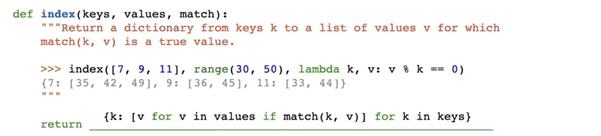

## 列表

列表是一种数据结构,可以保存有序的项目集合.这些项可以是任何数据类型,包括数据,字符串甚至其他列表.方括号以括号分割的方式创建一个列表

```python
list = [1,2,3,[3,4,5],[4,[4,45,5]]]
```

每一个位置都有一个索引,最左侧的元素索引为0

负索引从末尾开始计数,最右边的元素索引是`-1`

链表之间用`+`会创建一个较长的列表,其中包含已经添加的元素

## 列表推导式

列表推导式描述列表中的元素,并且计算出包含这些元素的新列表

有两种形式

```python
[<expression> for <element> in <sequence>]
[<expression> for <element> in <sequence> if <conditional>]
```

例如`>>> [i*i for i in [1, 2, 3, 4] if i % 2 == 0]`就创建了一个`[4, 16]`这样的列表

表示的是如果`i`能够被2整除的时候,使用`i*i`对其进行平方

用for循环重新写成等效的for语句,就如下

```python
>>> result = []
>>> for i in [1, 2, 3, 4]:
...     if i % 2 == 0:
...         result = result + [i*i]
>>> result
[4, 16]
```

注意python中的列表可以通过`+`的方式在末尾追加

## For语句遍历列表

for语句为序列的每一个元素执行代码,每次执行代码的时候for后面的名称都会绑定到序列的不同元素

```python
for <name> in <expression>
        <suite>
```

首先`expression`必须为一个序列,对于每一个元素,按照顺序执行

1. `<name>`绑定到元素
2. `<suite>`执行

例如下一个示例

```python
for x in [-1,4,2,0,5]
        print("现在的元素是",x)
```

就会遍历整个列表,依次输出打印

```cmd
Current elem: -1
Current elem: 4
Current elem: 2
Current elem: 0
Current elem: 5
```

考虑统计一个值在序列中出现了多少次的问题。我们可以使用`while`循环实现一个函数

```python
while index < len(s)
        index += 1
        ...
```

for就先不需要引入index变量

### 序列解包

程序中的一个常见情况是序列的元素也是序列，但所有内部序列的长度是固定相同的

`for` 循环可以在头部的 `<name>` 中包含多个名称，来将每个元素序列“解包”到各自的元素中

例如

```python
>>> pairs = [[1, 2], [2, 2], [2, 3], [4, 4]]
```

此时我们希望找到有多少第一元素和第二元素相同的内部元素对，下面的 `for` 循环在头部中包括两个名称，将 `x` 和 `y` 分别绑定到每对中的第一个元素和第二个元素

```python
>>> same_count = 0
>>> for x, y in pairs:
        if x == y:
            same_count = same_count + 1
>>> same_count
2
```

## 一些列表相关的函数

**SUM()函数**
`sum(s[,start])`,表示第二个参数start可选,可以没有

会把列表内所有数字加到start上,没有start的时候默认为0

如果列表内是别的类型的数字,那么不起作用

还可以这样写

```python
sum([2,3][4],[])
```
相当于`[]+[2,3]+[4]`

---

**MAX()函数**:

`max(range(5)` = `4`

实际上是一次次根据你调用的表达式的最大值作为输出

所以我们可以这样写

```python
max(range(10),key = lambda x:7-(x-4*(x-2)))
```

这段代码的作用是找到 `range(10)` 中使得 `key` 函数返回值最大的元素
1. **`range(10)`**：
   - 生成一个从 `0` 到 `9` 的整数序列。
2. **`key` 函数**：
   - `key=lambda x: 7 - (x - 4 * (x - 2))` 是一个匿名函数（lambda 函数），它接受一个参数 `x`，并返回 `7 - (x - 4 * (x - 2))`。
   - 这个 `key` 函数的作用是为每个 `x` 计算一个值，`max` 函数会根据这个值来决定哪个 `x` 是最大的。
3. **`max` 函数**：
   - `max` 函数会遍历 `range(10)` 中的每个元素 `x`，并通过 `key` 函数计算一个值。
   - 最终返回使 `key` 函数返回值最大的那个 `x`。

这是max的另外一种用法:使用key参数;`key` 参数是一个函数，`max` 会遍历可迭代对象中的每个元素，将其作为输入传递给 `key` 函数

`max` 会比较 `key` 函数的返回值，而不是直接比较元素本身

返回得到最大的key函数返回值对应的x

---
## Range()

在 Python 中，`range` 是一个内置函数，用于生成一个不可变的整数序列。当你调用 `range(3, 6)` 时，Python 并不会立即生成所有的数字，而是返回一个 `range` 对象。这个对象是一个**惰性序列**，只有在需要时才会生成具体的值

```cmd
>>> range(3,6)
range(3, 6)
```
注意6之前还有一个空格

## Strings

字符串可以表示任意文本,用单引号或双引号括起来

字符串满足序列的基本条件
1. 具有长度
2. 可以元素选择

长度由`len(s)`函数给出,元素选择由`[]`选择得到

三引号字符串:可以跨越多行,我们在注释里经常这么写

字符串强制转换:可以通过调用`str()`函数来强制转换类型为字符串

例如`str(2)`得到一个`2`

## 高阶函数

序列处理的常见模式可以使用高阶函数来表示

```python
>>>def apply_to_all(map_fn,s):
		return [map_fn(x) for x in s]
```
还可以选择`if`表达式对元素进行选择

许多形式的聚合都可以被表示为：将双参数函数重复应用到 `reduced` 值，并依次对每个元素应用
```python
>>> def reduce(reduce_fn, s, initial):
        reduced = initial
        for x in s:
            reduced = reduce_fn(reduced, x)
        return reduced
```
reduce_fn是函数,s是列表,initial是初始值

例如我们可以用reduce函数把每一个元素相乘,使用mul作为reduce_fn,1作为初始值,reduce可以用于将序列内的数字相乘
```python
>>> reduce(mul, [2, 4, 8], 1)
64
```
也可以使用这些高阶函数寻找完美数
```python
>>> def keep_if(filter_fn, s):
        return [x for x in s if filter_fn(x)]
>>> def divisors_of(n):
        divides_n = lambda x: n % x == 0
        return [1] + keep_if(divides_n, range(2, n))

>>> divisors_of(12)
[1, 2, 3, 4, 6]
>>> from operator import add
>>> def sum_of_divisors(n):
        return reduce(add, divisors_of(n), 0)

>>> def perfect(n):
        return sum_of_divisors(n) == n

>>> keep_if(perfect, range(1, 1000))
[1, 6, 28, 496]
```

**约定俗成的名字（Conventional Names）**：在计算机科学中，`apply_to_all` 更常用的名称是 `map`，而 `keep_if` 更常用的名称是 `filter`。Python 中内置的 `map` 和 `filter` 是以上函数的不以列表为返回值的泛化形式。上面的定义等效于将内置 `map` 和 `filter` 函数的结果传入 `list` 构造函数

在 Python 程序中，更常见的是直接使用列表推导式而不是高阶函数，但这两种序列处理方法都被广泛使用。

## 字典

`list()`函数可以直接打印键,也可以用for语句遍历

`字典名.values`取出所有的值,得到一个列表

字典也可以构建空元素

字典的值也可以是列表,每一个的值的数据类型也不需要一样

字典键不能重复使用,会只取到第二个

键本身不能是列表或者字典,是一个不可哈希的列表类型(学了CS61B就会了)

字典也有字典推导式: 前面是`<key  exp> :<value exp>`
的形式,其他都一样



很妙的例子

## 序列解码again
```python
>>>pair = [1,2]
>>>pair
[1,2]
>>>x,y = pair
>>>x
1
>>>y
2
```
这个过程叫`unpacking a list`

```python
>>>from operator import getitem
>>>getitem(pair[],0)
1
>>>getitem(pair[],1)
2
```

*gcd()*计算最大公约数的函数

```python
from fractions import gcd
```

## 序列抽象

**成员资格**:可以用于测试某个值在序列中的成员资格

Python 有两个运算符 `in` 和 `not in`，它们的计算结果为 True 或 False，取决于元素是否出现在序列中

```python
>>> digits
[1, 8, 2, 8]
>>> 2 in digits
True
>>> 1828 not in digits
True
```
**切片（Slicing）**：一个切片是原始序列的任意一段连续范围，由一对整数指定。和 `range` 构造函数一样，第一个整数表示起始索引，第二个整数是结束索引加一。（译者注：和前面的 `range` 一样，其实还有第三个参数代表步长，最经典的例子是使用 `s[::-1]` 得到 `s` 的逆序排列，具体可以自行搜索）

### 序列对象

我们可以利用列表的构造器函数 `list` 来对一个列表进行复制。复制完成后，两个列表数据的改动不会再影响彼此，除非二者共享了同一份数据。
```python
>>> nest = list(suits)  # 复制一个与 suits 相同的列表，并命名为 nest
>>> nest[0] = suits     # 创建一个嵌套列表，列表第一项是另一个列表
```
根据当前的运行环境，改动变量 `suits` 所对应的列表数据会影响到 `nest` 列表的第一个元素，也就是我们上面刚刚创建的嵌套列表，而 `nest` 中的其它元素不受影响


如果是这样的就会导致,不论改变哪一个值,两个列表的值都会一起改动

```python
nest = suit
```
此时两个变量指向同一个变量

尽管两个列表的元素值相同，但他们仍然可能是完全不同的两个列表对象，所以我们需要一个机制来验证两个对象是否相同。Python 提供了 `is` 和 `is not` 两种比较操作符来验证两个变量是否指向同一个对象

如果两个对象的值完全相等，则说明它们两个是同一个对象，对其中任意一个对象的改动都将影响到另外一个。身份验证比简单的相等验证更准确

	最后两个比较说明了 `is` 和 `==` 的区别。前者是检验的是对象的内存地址，而后者只是判断内容是否相同

**列表推导式。** 列表推导式总会返回一个新列表。举例来说，`unicodedata` 模块记录了 Unicode 字母表中每个字符的官方名称。我们可以通过字符名称找到对应的 unicode 字符，包括卡牌花色。
## Tree

树是一种基本数据抽象，它对分层值的结构和操作方式施加了规律性

树具有**根标签**和**分支列表**。

*构造的函数都要有这两个参数*

树的每个分支都是一棵树。**没有分支的树称为叶子**。树中包含的任何树都称为该树的子树（例如分支的分支）。树的每个子树的根称为该树中的节点

树的数据抽象由**构造函数树**和**选择器** label 和 **分支**branches 组成

```python
>>> def tree(root_label, branches=[]):
        for branch in branches:
            assert is_tree(branch), '分支必须是树'
        return [root_label] + list(branches)

>>> def label(tree):
        return tree[0]

>>> def branches(tree):
        return tree[1:]
```
只有当树有根标签并且所有分支也是树时，树才是结构良好的

在 `tree` 构造函数中使用了 `is_tree` 函数以验证所有分支是否结构良好
```python
>>> def is_tree(tree):
        if type(tree) != list or len(tree) < 1:
            return False
        for branch in branches(tree):
            if not is_tree(branch):
                return False
        return True
```


`is_leaf` 函数检查树是否有分支，若无分支则为叶子节点
```python
>>> def is_leaf(tree):
        return not branches(tree)
```
树可以通过嵌套表达式来构造。以下树 `t` 具有根标签 3 和两个分支

```python
>>> t = tree(3, [tree(1), tree(2, [tree(1), tree(1)])])
>>> t
[3, [1], [2, [1], [1]]]
>>> label(t)
3
>>> branches(t)
[[1], [2, [1], [1]]]
>>> label(branches(t)[1])
2
>>> is_leaf(t)
False
>>> is_leaf(branches(t)[0])
True
```

### 树的抽象(代码实践)

```python
  

# Tree Data Abstraction

def tree(label, branches=[]):

    """Construct a tree with the given label value and a list of branches."""

    for branch in branches:

        assert is_tree(branch), 'branches must be trees'

    return [label] + list(branches)

  ```

接受标签和列表,默认情况是空列表

这就是树的构造器

```python

def label(tree):

    """Return the label value of a tree."""

    return tree[0]

  

def branches(tree):

    """Return the list of branches of the given tree."""

    return tree[1:]
```
这里我们构造label()函数取出label,使用branches()函数取出后面的列表内容

`tree[1:]`表示的是从索引1后面的所有元素构成的列表切片,可能就是单个值,也可能是多个分支

```python
  

def is_tree(tree):

    """Returns True if the given tree is a tree, and False otherwise."""

    if type(tree) != list or len(tree) < 1:

        return False

    for branch in branches(tree):

        if not is_tree(branch):

            return False

    return True

  
```
判断是不是tree,要添加一些检查

如果我们构造的tree不是一个列表类型的变量,或者长度小于1(也就是长度为0,只有空列表)

都不是tree

如果每一个分支里面,存在不是树的东西,那整个东西就可能不是一个tree
(都是基于定义的判断)可能就是一个leaf

```python
def is_leaf(tree):

    """Returns True if the given tree's list of branches is empty, and False

    otherwise.

    """

    return not branches(tree)

  
```
值得注意的是,我们上述已经做好了基本的tree类型的框架,

如果我们这样写

```python
tree(1,tree(5,tree(6)))
```
实际上是在调用函数,而不是python中内置了这一种类型

### Tree process

输入和输出都是tree的函数

```python
def print_tree(t, indent=0):

    """Print a representation of this tree in which each node is

    indented by two spaces times its depth from the root.

  

    >>> print_tree(tree(1))

    1

    >>> print_tree(tree(1, [tree(2)]))

    1

      2

    >>> numbers = tree(1, [tree(2), tree(3, [tree(4), tree(5)]), tree(6, [tree(7)])])

    >>> print_tree(numbers)

    1

      2

      3

        4

        5

      6

        7

    """

    print('  ' * indent + str(label(t)))

    for b in branches(t):

        print_tree(b, indent + 1)

  

def copy_tree(t):

    """Returns a copy of t. Only for testing purposes.

  

    >>> t = tree(5)

    >>> copy = copy_tree(t)

    >>> t = tree(6)

    >>> print_tree(copy)

    5

    """

    return tree(label(t), [copy_tree(b) for b in branches(t)])
```

实例:构造斐波那契树
```python
def fib_tree(n):
	if  n<=1:
		return tree(n)
	else:
		left,right = fib_tree(n-2),fib_tree(n-1)
		return tree(label(left)+label(right),[left,right])
```
注意要用到列表,来表示`left`和`right`两个分支的时候,我们用`[]`

其他时候我们用tree时需要用`()`表示这是函数调用

实例:数叶子数
```python
def count_leaves(t)
	if is_leaf(t):
		return 1
	else
		branch_counts=[count_leaves(b) for b in branches(t)]
		#把每一个branches的树叶数字做成一个列表,用sum来求总和
		return sum(branch_counts)
```
使用递归,汇总对每一个树枝的计算,巧妙之处在确定基本情况下返回什么以及如何聚合其递归调用

---

实例:利用sum函数的特点来构造leaves()函数
leaves函数:返回一个列表,里面是只包含了树叶,不包含label

sum的特性
```python
>>>sum([[1],[2,3],[4]],[])
[1,2,3,4]
>>>sum([[[[1]],[2]],[3]],[])
[[[1]], [2], 3]
```

```python
def leaves(tree):
	if is_leaf:
		return [label(tree)]
	else:
		return sum([leaves(b) for b in branches(tree)])
```

为什么要`return sum([leaves(b) for b in branches(tree)])`而不是直接
`return sum[branches(tree)]`

`branches(tree)` 会返回当前树的所有子树，`sum([branches(tree)])` 会将这些子树合并成一个列表，但不会进行递归操作，也不会考虑叶子节点

`leaves(b)` 会返回分支 `b` 下所有叶子节点的标签，`sum` 会将这些标签合并成一个单一的列表. 本质上，这个表达式会遍历整棵树并收集所有的叶子节点

`leaves(tree)` 关注的是获取树的所有叶子节点，而 `branches(tree)` 仅仅关注当前树的直接子树

以后想要使用这些tree的定义,我们可以直接`from tree import * `全部导入

## 面向对象编程

>面向对象编程 (object-oriented programming) 的核心就是向数据添加状态

### 对象


对象将数据的值和行为结合到了一起,对象可以直接表示某些信息,也可以用自身的表现行为来表达想表达的东西.

一个对象具体应该怎么和其他对象进行交互,都被封装并且绑定到了该对象自身的某些值上.当我们试图打印某个对象,它自己知道应该如何以文字的形式表示自己

如果一个对象由多个部分组成,它知道应该怎么根据实际情况对外展示那些不同的部分

对象既是数据信息,又是操作流程

在 Python 中，对象的行为是通过特定的语法和术语实现的，以日期为例

```python
>>> from datetime import date
>>> tues = date(2014, 5, 13)
>>> print(date(2014, 5, 19) - tues) 
6 days, 0:00:00
```
`date` 这个名称是一个 `class` 类,一个类代表了一种值。具体的日期被称为这个日期类的实例对象,要想构建一个实例对象，可以用特定的参数去调用该类得到

尽管 `tues` 是用基础数字构建出来的，但它具有日期的能力.用另一个日期减掉它，我们可以得到一个时间间隔

对象有`属性`（attributes）的概念，可以理解为该对象中某个值的名字

和其它许多编程语言一样，我们在 Python 中使用**点语法**来访问一个对象中的某个属性
```python
>>> tues.year
2014
```

对象还有**方法**（methods）的概念，其实也是属性，**只不过该属性的值是函数**

具体实现起来，方法就是**根据其自身的输入参数**以及**它所在的对象**来**计算特定结果的函数**

`strftime` （string format of time） 方法接受一个参数，该参数描述了具体的时间展示格式
```python
>>> tues.strftime('%A, %B %d')
'Tuesday, May 13'
```
要计算 `strftime` 的返回值需要两个输入：期望展示的时间格式，以及 `tues` 中包含的日期信息.这个方法内部已经有了处理日期相关的逻辑，并且能够返回我们期望的结果。我们从来没有说过 2014 年 5 月 13 日是星期二，但是日期这个类本身就有这种能力

不仅 date 是对象，我们之前提到的数字、字符串、列表、区间等都是对象。它们本身表示数据，同时还拥有它们所代表的数据的行为。它们还有属性和方法。举例来说，字符串有一系列帮助我们处理文本的方法

```python
>>> from unicodedata import lookup
>>> [lookup('WHITE ' + s.upper() + ' SUIT') for s in suits]
['♡', '♢', '♤', '♧']

```


### 对象的可变性

所有指向对象的变量都有可能变化

同一个对象在计算过程中可以变化其值,每一个指向该对象的变量都会因此而改变

仍然绑定在同一个内存的数据,但是数据发生了变化,也就是变异

只有可变类型的对象可以改变其值

列表和字典都是可变类型

>
>- `append(elem)`: Add `elem` to the end of the list. Return `None`.
>- `extend(s)`: Add all elements of iterable `s` to the end of the list. Return `None`.
>- `insert(i, elem)`: Insert `elem` at index `i`. If `i` is greater than or equal to the length of the list, then `elem` is inserted at the end. This does not replace any existing elements, but only adds the new element `elem`. Return `None`.
>- `remove(elem)`: Remove the first occurrence of `elem` in list. Return `None`. Errors if `elem` is not in the list.
>- `pop(i)`: Remove and return the element at index `i`.
>- `pop()`: Remove and return the last element.
>
>Dictionaries also have item assignment (often used) and `pop` (rarely us

需要注意`==`和`is`的区别

### 迭代器

[iterators](CS/Python/iterators.md)
