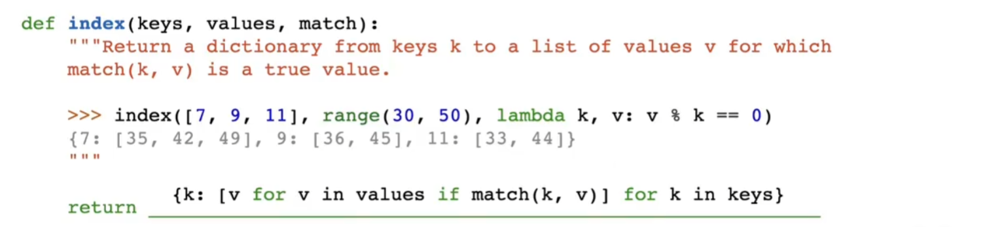

##  Tree class

作为`Tree`的类,有两个属性,`label`和`branches`,分别表示节点的值和子节点.

- `label`是一个值,表示节点的值,存储在树根
- `branches`是一个列表,列表内都是Tree种类的变量,表示子节点

此处给出省略了`__repr__`和`__str__`的`Tree`类的定义:

```python
class Tree:
    def __init__(self, label, branches=[]):
        self.label = label
        for branch in branches:
            assert isinstance(branch, Tree)
        self.branches = list(branches)
    def is_leaf(self):
        return not self.branches
    #如果是叶子节点,self.branches为`[]`,所以返回not False,即True
```

要从标签`x`(任意值)和分支列表 `bs` (Tree 实例列表)构造 `Tree` 实例并为其指定名称`t`需要这样写:`t = Tree(x, bs)`

对于树 t：

1. `t.label` 是根节点的值
2. `t.branches` 是一个列表,且始终是一个Tree类型的实例,表示子节点
3. 如果`t.is_leaf()`为`True`时,`t_branches`为空列表
4. 要构建带有标签x的叶子,可以使用`t = Tree(x)`
5. 要构建一个没有子节点的树,可以使用`t = Tree(x, [])`

### 打印树

1. `repr(t)` 返回计算结果为等效树的 Python 表达式
2. str(t) 为每个标签返回一行，该标签的缩进次数比其父级多一次，且子级位于其父级之下

```python
>>> t = Tree(3, [Tree(1, [Tree(4), Tree(1)]), Tree(5, [Tree(9)])])

>>> t         # displays the contents of repr(t)
Tree(3, [Tree(1, [Tree(4), Tree(1)]), Tree(5, [Tree(9)])])

>>> print(t)  # displays the contents of str(t)
3
  1
    4
    1
  5
    9
```

### 更改树

- t.label = y 将 t 的根标签更改为 y（任何值）
- t.branches = ns 将 t 的分支更改为 ns（Tree 实例的列表）
- t.branches.append(b) 将树 b 添加到 t 的分支列表中
- t.branches.pop(i) 从 t 的分支列表中删除索引为 i 的树
- t.branches[i] 返回 t 的第 i 个分支
- t.branches[i] = b 将 t 的第 i 个分支更改为树 b
- t.branches[0].label = y 会将最左侧分支的根标签更改为 y。

## 函数抽象实现的树vs类实现的树

- 函数抽象实现的树是一个列表,列表的第一个元素是根节点的值,第二个元素是子节点的列表
- 类实现的树是一个类,类的属性有`label`和`branches`,分别表示节点的值和子节点



## 注意点

```python
>>>t = Tree(3, [Tree(2, [Tree(5)]), Tree(4)])
# 正确
>>>t = t = Tree(1, Tree(2))
#错误,因为Tree(2)不是一个列表
```

`Tree.branches[i]`直接返回`Tree`实例,也就是显示的`Tree`实例的`__repr__`的返回值,注意这里的`Tree`实例是类的实例,不是函数抽象的实例,类的实例在`__repr__`中返回的是`Tree(label, branches)`的形式,而函数抽象的实例返回的是`[label, branches]`的形式

```python
>>> t = Tree(1, [Tree(2)])
>>> t.label
? 1
-- OK! --

>>> t.branches[0]
? Tree(2)
-- OK! --
```

**不用return传递值**:

```python
def cumulative_mul(t):
    """Mutates t so that each node's label becomes the product of its own
    label and all labels in the corresponding subtree rooted at t.

    >>> t = Tree(1, [Tree(3, [Tree(5)]), Tree(7)])
    >>> cumulative_mul(t)
    >>> t
    Tree(105, [Tree(15, [Tree(5)]), Tree(7)])
    >>> otherTree = Tree(2, [Tree(1, [Tree(3), Tree(4), Tree(5)]), Tree(6, [Tree(7)])])
    >>> cumulative_mul(otherTree)
    >>> otherTree
    Tree(5040, [Tree(60, [Tree(3), Tree(4), Tree(5)]), Tree(42, [Tree(7)])])
    """
    "*** YOUR CODE HERE ***"
    # Base case: if the tree is empty, return
    for b in t.branches:
        cumulative_mul(b)
    total = t.label
    for b in t.branches:
        total *= b.label
    t.label = total
```

用return的版本

```python
def cumulative_mul(t):
    if t.is_leaf():
        return t.label
    else:
        for b in t.branches:
            t.label *= cumulative_mul(b)
        return t.label
```

解析return的版本:

1. 如果`t`是叶子节点,返回`t.label`,此时`cumulative_mul(b)`返回的是叶子节点的值.这是递归的base case
2. 如果`t`不是叶子节点,也就是`t`是树,那么遍历每一个branches,把每一个branches的值都乘到`t.label`上,然后返回`t.label`
3. cumulatve_mul(b)返回的是叶子节点的值,base case返回的是叶子节点的值,然后返回的是label*(is_leaf)的label值,然后是不断的递归,直到遍历完所有的branches

解析不用return的版本:

1. 遍历每一个branches,不断调用cumulative_mul(b),直到遍历完所有的branches
2. 经过for循环之后我们首先到达的是base case
3. base case没有t.branches.所以不会进入for循环,t.label 不变
4. 然后我们回到上一层,此时b.label已经是叶子节点的值,所以我们可以计算出t.label是所有b.label的乘积再乘上t.label
5. 不断返回递归,直到遍历完所有的branches


**lambda函数使用**:

```python
def prune_small(t, n):
    """Prune the tree mutatively, keeping only the n branches
    of each node with the smallest labels.

    >>> t1 = Tree(6)
    >>> prune_small(t1, 2)
    >>> t1
    Tree(6)
    >>> t2 = Tree(6, [Tree(3), Tree(4)])
    >>> prune_small(t2, 1)
    >>> t2
    Tree(6, [Tree(3)])
    >>> t3 = Tree(6, [Tree(1), Tree(3, [Tree(1), Tree(2), Tree(3)]), Tree(5, [Tree(3), Tree(4)])])
    >>> prune_small(t3, 2)
    >>> t3
    Tree(6, [Tree(1), Tree(3, [Tree(1), Tree(2)])])
    """
    while len(t.branches) > n:
        largest = max(t.branches, key=lambda x:x.label)
        t.branches.remove(largest)
    for i in t.branches:
        prune_small(i, n)

```

这里的`max(t.branches, key=lambda x:x.label)`是找到branches中label最大的那个branches,然后删除掉

`lambda x:x.label`是一个匿名函数,表示输入x,返回x.label,t.branches中的每一个元素都是Tree实例,所以x.label就是for i in branches的i.label

#lambda

