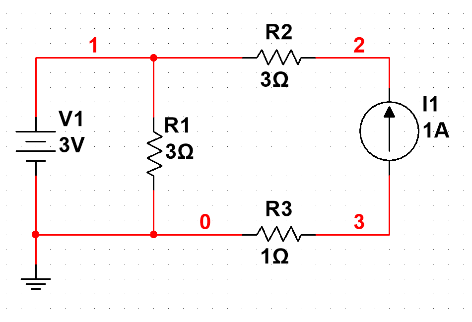
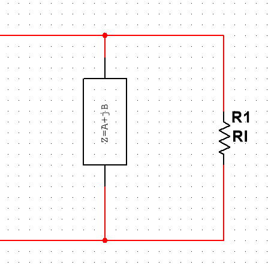
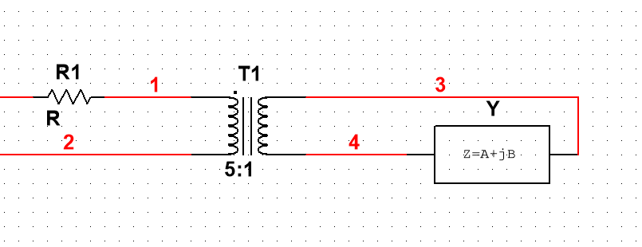
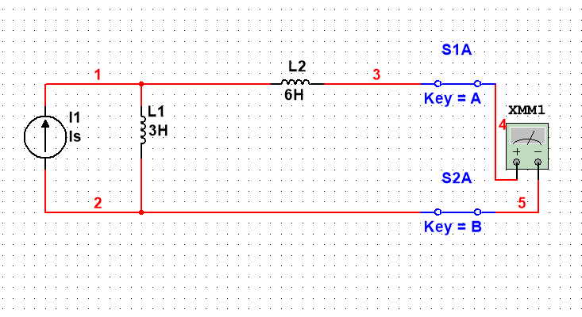
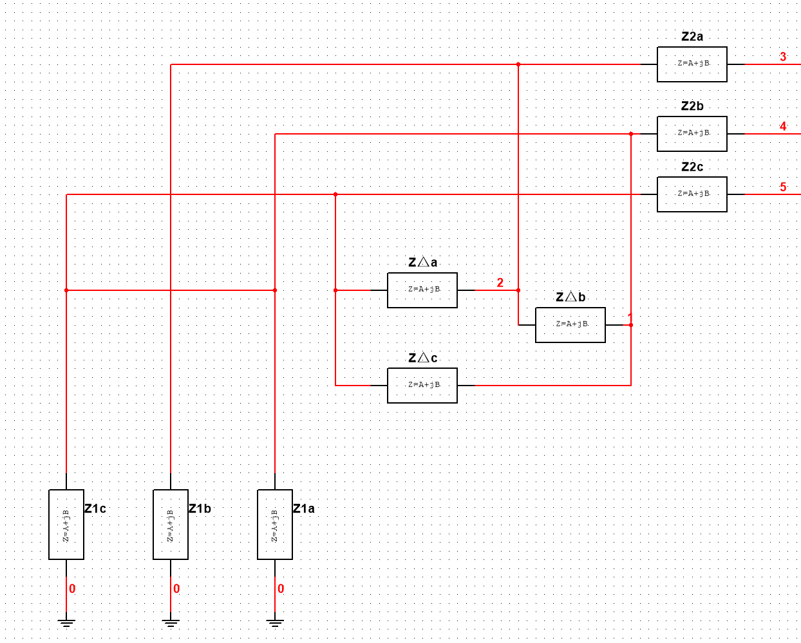
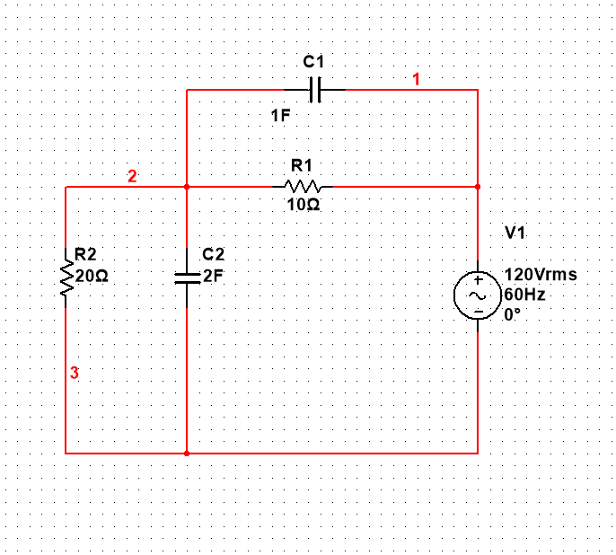

1. 求电流源两段的电压$U_{23}$和电源发出的功率P
{width=50%}

---

2. $U_1=10\sqrt{2}sin(1000t+30^\circ)$,U1相位表示:___

$U_1+U_2=5\sqrt{3}\angle 0^\circ$,求U2的瞬时表达式

---

3. 复数功率$\widehat{S}=300+j400$,则有功功率为___.无功功率为___.视在功率为,功率因数$cos\psi$为___.若将功率因数提高到0.9v,则要关联电容$C=\qquad\mu$ F$(U=200V,f=50Hz)

---

4. RC并联电路,$\omega = 100rad/s$,$Z=4-8j$,$R $= ___  $\Omega$,$C$= ___$ F$

---

5. Z纯阻性,此时Rl功率为$P=4w$,$I_5$变成5$I_3$,Rl功率P=___w

{width=50%}

---

6. 导纳$Y=5\angle 53^\circ$,原等效阻抗为___.原边电压为___.

---

7.$I_S=2e^{-6t}A$,则$U_{ab}$=___V(图中电压表的读数)

8. $U_A=100\angle 0^\circ$, $Z_2=1+2j$,$Z_1=4+4j,Z_{\Delta}=12+12j$,$Z_{\Delta}$,相电流 $\overset{\cdot}{I}_{12}$___  相电压 ___  $Z1$ 总功率___.

9. $C1=1F$,$C2=2F$,$R1=10Ω$,$R2=20Ω$,$Us=10v$,开关闭合之后,$U_{c1}(0^+)$= ___ ,$U_{c2}(0^+)$= ___ .

10. $L=100mH$,$C=0.01F$,谐振频率为$\omega_0$=\_\_\_rad/s,品质因数Q=\_\_\_.

