## 结构和功能描述

1. 组合电路只存在输入至输出的信号传输通道，因此输出完全由该时刻的输入决定
2. 组合电路不含触发器等记忆元件
3. 组合电路的功能描述有:逻辑函数表达式,真值
表,卡诺图,逻辑电路图.

>掌握组合逻辑电路的一般设计方法,能按给定要求设计出逻辑函数表达式.

---

**一般分析组合电路的方法**:

1. 看着电路的结构写出表达式
2. 化简
3. 写出真值表/卡诺图
4. 判断逻辑功能

**设计组合电路的方法**:

1. 分析给定的逻辑功能要求,确定输入输出变量2
2. 根据设计要求列出真值表/卡诺图/状态转换图
3. 求出输出的逻辑函数的表达式
4. 按照制定的逻辑门电路画出相应的逻辑函数图

---

## 编码器

编码器是将一个特定对象变换成一组数码输出的组合逻辑电路

分类:基本编码器和优先编码器.

又分为二进制编码器和BCD编码器.

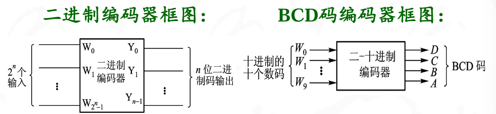{width=50%}

---

**4线-2线基本编码器**:

真值表:

| w0 | w1 | w2 | w3 | y0 | y1 |
|----|----|----|----|----|----|
| 1  | 0  | 0  | 0  | 0  | 0  |
| 0  | 1  | 0  | 0  | 1  | 0  |
| 0  | 0  | 1  | 0  | 0  | 1  |
| 0  | 0  | 0  | 1  | 1  | 1  |

Y1 = W2 + W3
Y0 = W1 + W3

由于基本编码器的输入和输出具有严格的一一对应关系，任何时候都不允许有两个或两个以上的输入为1(即WiWj=0, i≠j).否则将会产生编码混乱

>可见,基本编码器的每个输出都可由或门构成.由或门组成的逻辑电路

---

**8421BCD码优先编码器**:

>优先编码器允许两个或两个以上的待编码对象同时输入，但只对优先权高的对象进行编码，而优先权的大小（高低）在设计时预先约定

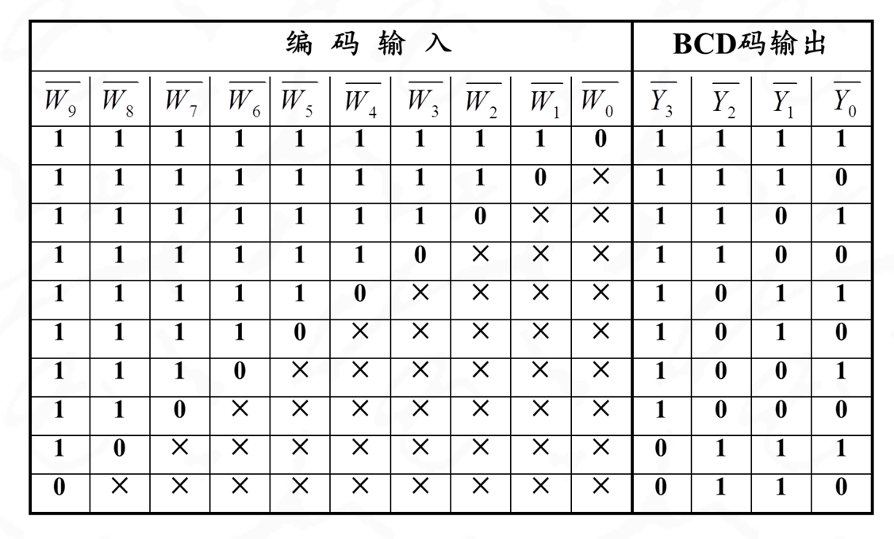{width=50%}

- 输入：$\overline{W0}$...$\overline{W9}$,代表十进制的十个数，反码输入，“0”表示有输入，“1”表示无输入
- 输出：Y3、Y2、Y1、Y0表示输出四位代码，并用反
码表示
优先权：采用大数优先的原则，即W9优先权最高,
W0优先权最低

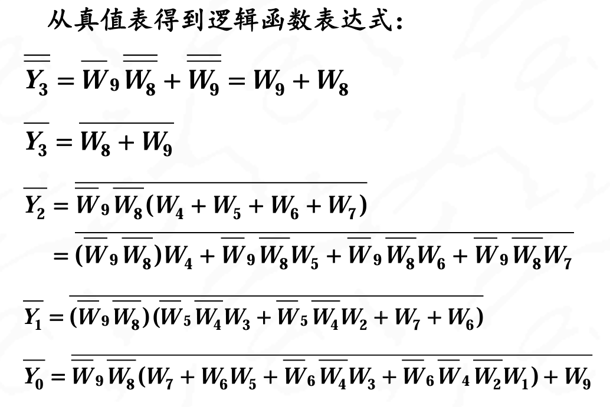{width=50%}

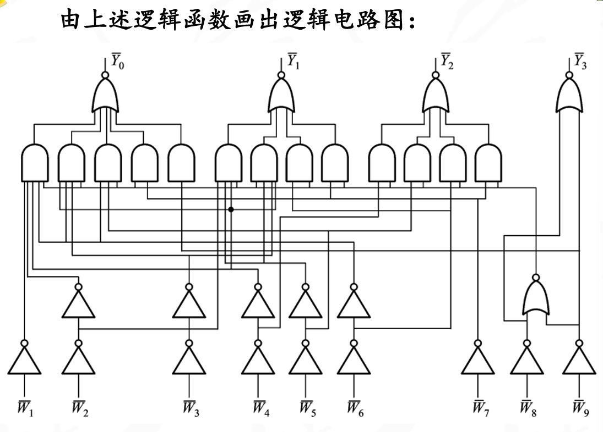{width=50%}

## 译码器

译码是编码的反过程.即:将二进制代码所代表的特定对象还原出来。根据还原对象的不同,分为二进制译码器（基本译码器）和二-十进制译码器（码制变换译码器、显示译码器）

二进制译码器把n位二进制代码代表的2n个对象还原出来，例如：2线-4线译码器，3线-8线译码器，4线-16线译码器等等

**二-十进制译码器**:将输入BCD码翻译成十进制数码的组合逻辑电路，所以，又称显示译码器

{width=50%}

## 数码管

分为点阵式和分段式

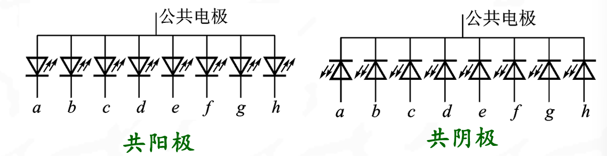{width=50%}

共阳极数码管适用于低电平输出的译码器；而共阴极的数码管适用于高电平输出的译码器

---

## 数据选择器

数据选择器是实现从多路输入数据中，在选择地址的控制下，选择一路送到输出端的组合逻辑电路。它的功能类似于物理机械开关

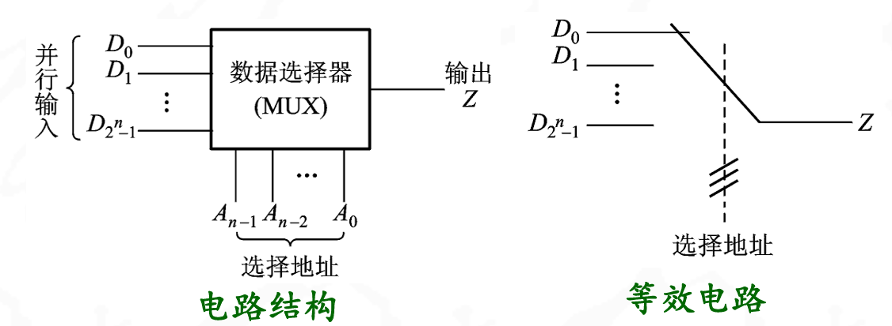{width=50%}

---
四选一数据选择器:

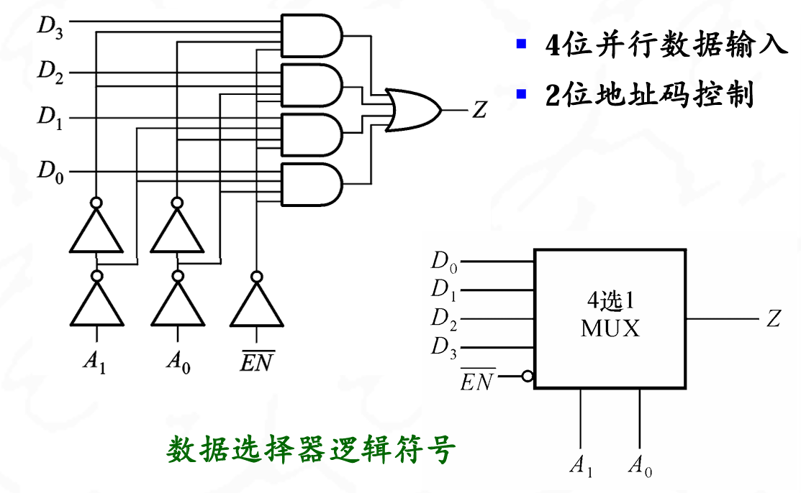{width=50%}

真值表

|Not EN| A1 | A0 | Z |
|-------|----|----|---|
| 1     | X  | X  | 0 |
| 0     | 0  | 1  | D1 |
| 0     | 1  | 0  | D2 |
| 0     | 1  | 1  | D4 |
| 0     | 0  | 0  | D0 |

$$Z=D_3m_3+D_2m_2+D_1m_1+D_0m_0$$

## 数据分配器

将一路串行输入数据，在n位地址的控制下，依次分配到2n个通道上去

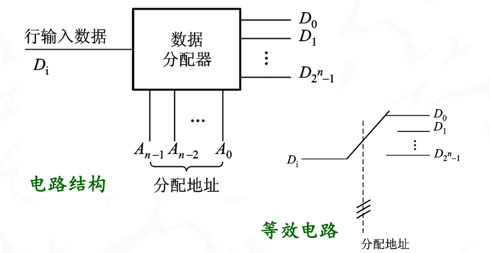{width=50%}

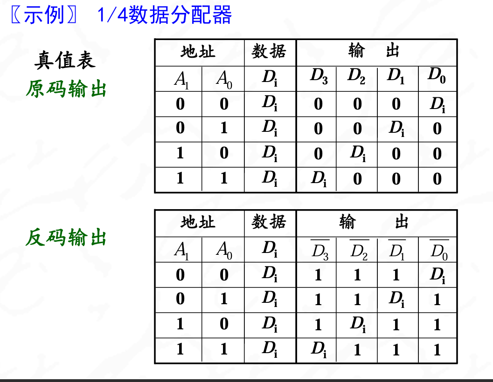{width=50%}

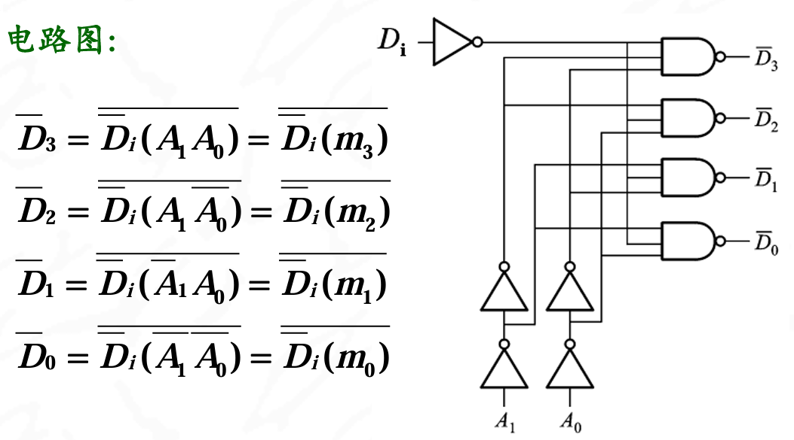{width=50%}

实际是一个译码器,A1A0当作译
码器的代码输入，Di作译码器的使能控制.因此,一个具有使能控制端的译码器可以用作数据分配器

## 半加器

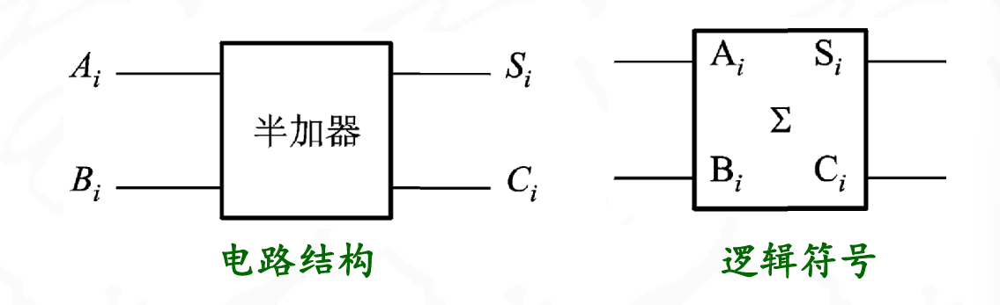

$$S_i = A_i\oplus B$$
$$C_i = A_iB_i$$

## 全加器

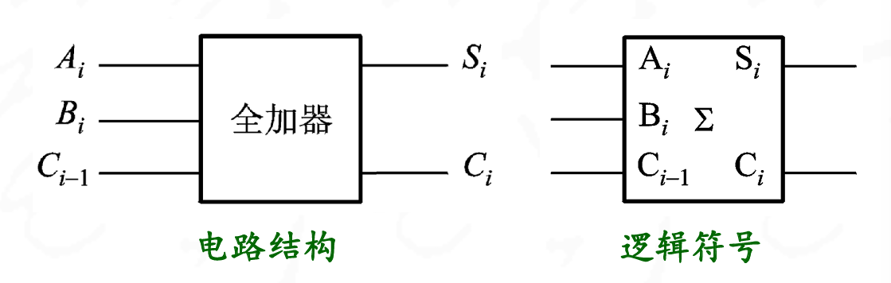

真值表

| A | B | Ci-1 | S | C1 |
|----|----|------|---|----|
| 0 | 0 | 0    | 0 | 0  |
| 0 | 0 | 1    | 1 | 0  |
| 1 | 0 | 0    | 1 | 0  |
| 0 | 1 | 0    | 1 | 0  |
| 0 | 1 | 1    | 0 | 1  |
| 1 | 0 | 1    | 0 | 1  |
| 1 | 1 | 0    | 0 | 1  |
| 1 | 1 | 1    | 1 | 1  |

$$S_i = A_i\oplus B_i \oplus C_{i-1}$$

$$C_i = (A_i B_i)+( A_i\oplus B_i)C_{i-1}$$

两个半加器和一个或门实现的全加器电路

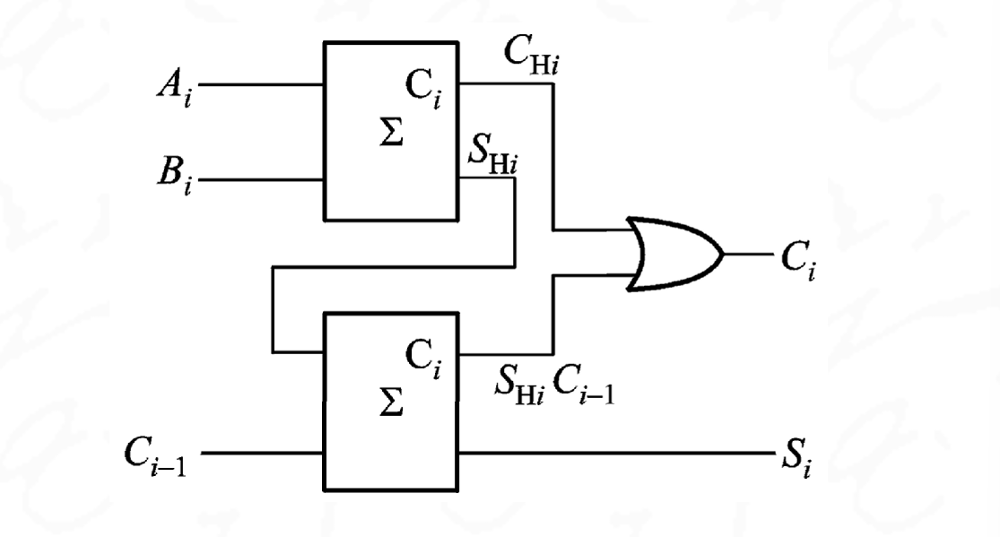{width=50%}

---

**奇偶校验器**:

在被传输的数据后面加一位奇偶校验位,使这一组数据中含1的个数成为奇数(或者偶数).再在接收端检测含1的个数是奇数还是偶数,可以判断数据传输是否有误

略,考完试回来补充这块内容

---

## 竞争和冒险

组合逻辑电路在实际应用时,由于电路中存在传输延迟时间，有时会使逻辑电路产生误动作（不必要的尖峰脉冲），称为竞争-冒险现象

??? "与门输出高电平窄脉冲,或门输出低电平窄脉冲"
    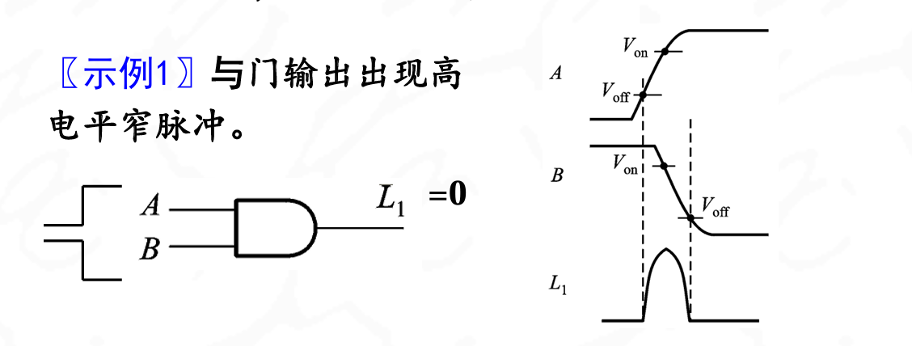
    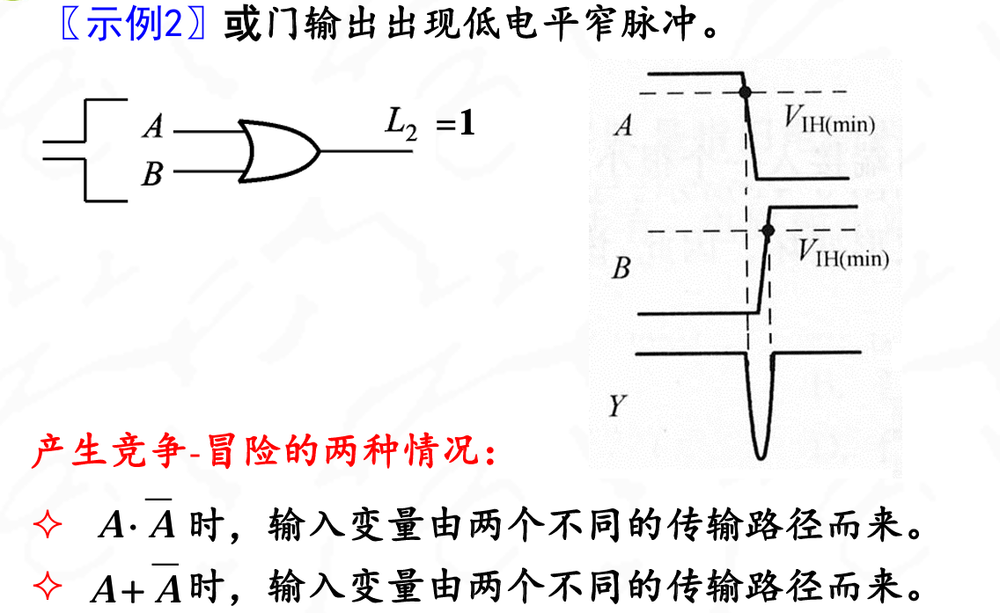

产生竞争和冒险的两种情况

1. A $\overline{A}$
2. A+$\overline{A}$

它们的输入变量都从两个不同的输入路径而来

竞争-冒险的判别方法:
检查输出函数是否在一定条件下被简化成:
A $\overline{A}$或者 A + $\overline{A}$

??? "竞争-冒险的判别"
    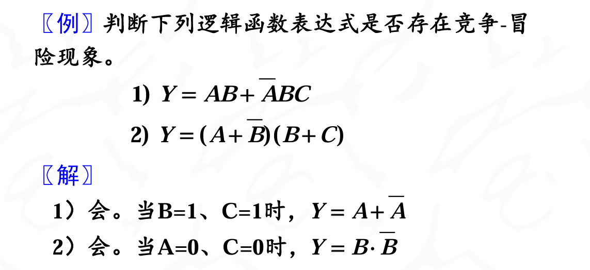{width=50%}

只要有条件使得存在上面的式子,就会存在竞争和冒险

---

### 消除方法

1. 引入选通脉冲
2. 接滤波电容
3. 修改逻辑设计,增加冗余项

---