## 基础门电路

### 集成门电路的一般特性

1. 逻辑电平和噪声容限

在数字电路中，通常由多级门电路连接而成。显然，接收方（负载门）需要能正确识别发送方（驱动门）传递的逻辑信号.

考虑到元件参数的离散性，即数字器件由不同厂家生产，要求数字器件的输入电平、输出电平都必须遵循一定的电平规范

??? note "TTL电平规范"
    

噪声容限图解:

{width=50%}

## TTL集成逻辑门

>TTL与非门,CMOS非门,与非门,或非门的内部电路只需一般了解即可.所以这里以简单列举为主

### TTL与非门

{width=50%}

1. 多发射极管T1为输入级，实现与逻辑.与的功能在AB处实现,是一个并联结构.
2. T2是中间级,提供两个相反的驱动信号
3. T4T5输出

**低电平时**:$V_i=0.3v$,T1饱和,T2T4截止TTL关门,T4导通,输出高电平,约3.6v

**高电平时**:$V_i=3.6V$,T1倒置,T2T5饱和.T4截止,输出是低电平,约0.3v

---
改进:

{width=50%}

---

**传输特性**:

其中有三个传输特性:关门电压.开门电压,阈值电压

{width=50%}

>阈值电平VT:开门电平与关门电平十分接近,两个电平的中间值称为阈值电平.

---

## TTL电气特性

**输入端**:

- TTL电路输入端悬空相当于接高电平
- 接小阻值电阻相当于接“低电平”
- TTL门输入端接大阻值电阻相当于接“高电平”

??? note "例题"
    {width=50%}

[对电路符号感到疑惑可以看看这个](https://blog.csdn.net/qq_43284098/article/details/107055582)

---

**输出端**:

*扇出系数*: 一个门电路的输出可以连多个门电路的输入。允许连接的负载门个数称为一个门的扇出系数.衡量的是门电路带负载能力的重要指标

>门电路相连时，不仅要考虑电压需符合电平规范，还需要考虑负载电流的影响，即输出端负载特性

{width=50%}

---

负载特性分为**输出高电平**和**输出低电平**两种情况

**输出低电平**:

当驱动门输出低电平时，电流是是从负载门流向驱动门,此时叫做*灌入*,这种负载成为灌电流负载

{width=50%}

当负载门个数增加时，负载电流IOL增加，驱动门的输出电平将增大

当低电平输出增大到VOL(max)所对应的负载电流,即为该门电路灌入时的最大负载电流IOL(max)

第电平输出时允许的带负载门的最大个数，即低电平扇出系数

**输出高电平**:

当驱动门输出高电平时,电流是从驱动门流出,并注入到负载门的输入端,为拉电流负载

{width=50%}

当负载门个数增加时，负载电流IOH增加，驱动门的输出电平将减小

??? note "例题"
    {width=50%}

TTL门电路的低电平灌电流远大于高电平拉电流.即：IOL>>IOH,所以扇出系数一般指的是低电平灌入的系数

传输延迟时间tpd:半导体器件内部存在分布电容,器件从截止状态到完全导通，或者从导通到截止状态，都需要时间.一般为几十纳秒

{width=50%}

---

## TTL电路输出结构

一般有三种输出结构:

- 推拉式
- 集电极开路
- 三态

---

**推拉式结构**:

前面的TTL与非门就是典型的推拉式结构

输出的两个晶体管总是互补式的工作,通常来说多个门电路的输出端不能并联

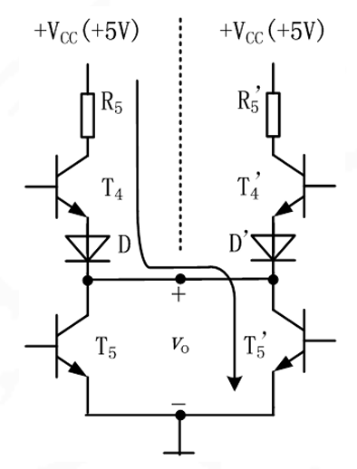{width=50%}

---

**集电极开路结构**:OC门是典型代表

省去T6和T4，集电极悬空，必须外接电阻(称为上拉电阻).**输出高电平为VCC1**,而不是3.6V

OC门符号:

虽然也是表示与非,但是有不同的特点:

1. 实现线与:多个OC门的输出端可直接相连,称为线与
    
2. 实现逻辑电平转换:OC门外接电源VCC1可以与门电路电源VCC一致,也可不同.当VCC1不同于VCC时,则输出高电平值得以改变,从而实现逻辑电平的转换

3. 提高抗干扰能力:外接电源VCC1可以高于门电路电源VCC,使输出高电平提高,从而使高电平噪声容限增大

4. 实现电平指示:外接上拉电阻支路中串联发光二极管,则可作为电平指示

---

**三态输出结构**:三态门

>三态输出是指除0、1两种状态外，还有高阻态
>输出高阻态时，相当于输出端与该门电路的内部连接处于断开状态

EN=1的时候,也就是$\overline{EN}=0$,D1,D2截止,A和\overline{L}实现了反相输出

EN=0的时候,也就是$\overline{EN}=1$,$D_1$导电,但是T4T5截止,输出相当于悬空为高阻态

{width=50%}

{width=50%}

实际应用时,三态门有多种形式.既可以是低电平使能,也可以是高电平使能;既有非门的三态门,也有其它逻辑（如与非门）的三态门,因此其电路符号也相应地有多种形式

注意**写EN**都是**输入高电平使能**,写**$\overline{EN}$**表示输入**低电平使能**

反映的是输入的电平

{witdh=50%}

??? note 例题
    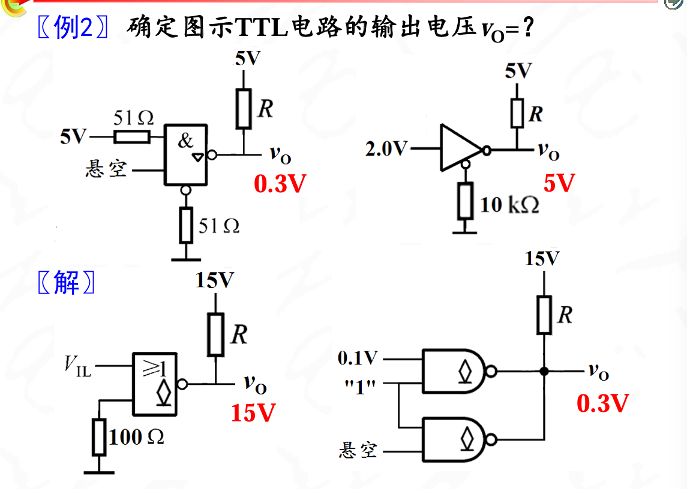

---

## CMOS集成逻辑门

CMOS门电路是用NMOS和 PMOS组成的互补型MOS电路。它在集成度、功耗、输出高低电平等方面，都比TTL优越，是目前集成电路的主流产品

>CMOS电路，使用时绝对不允许输入端悬空

---

**CMOS非门**:反相器,由增强型MOS管构成

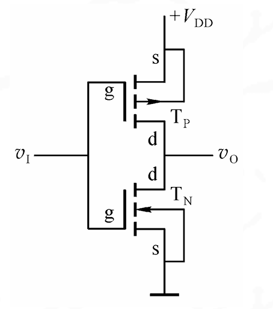{width=50%}

下面那个接地,上面接高电压

其中$V1$是输入，$V_2$是输出。设$V_{DD}>V_{TN}+\textbar{V_{TP}\textbar}$(大于二者的开启电压)

**若V1=VDD时**,下面那个$NMOS$的是$TN$,$NMOS$是源极和漏极为$N$掺杂,且此时栅极电压为$V_{GS}$,当$V_G>V_T$的时候导通,会产生电流(注意此时$V_S = 0v$)

$$v_O=V_{OL}\approx0V$$

此时的增强型PMOS管因为$V_{GS}=0v$,所以截止

**若V1=0v时**,$PMOS$是$TP$,此时是源极和漏极为$P$掺杂,此时栅极电压为$V_G$,在$V_{GS}<-V_T$的时候导通(注意这个$-V_T$,在他自己这里也是一个$V_T$)所以在$V_1 = 0v$的时候$TN$截止但是$TP$导通,(注意此时$V_S= V_{DD}$),此时

$$v_O=V_{OH}\approx V_{DD}$$

当然下面的NMOS管就因为$v_{gs}=0v$而截止

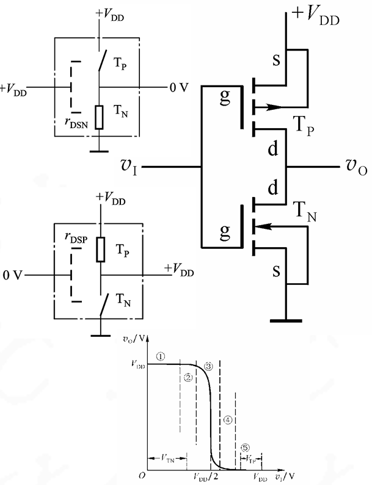{width=50%}

---

CMOS与非门

{width=50%}

- 当输入都为高电平时TN1,TN2导通,TP1,TP2截止,输出低电平
- 当输入有一个(或全部)为低电平时,TN中有一只(或全部)截止,TP1中有一只(或全部)导通,输出高电平

>NMOS串联，PMOS并联，构成与关系

---

CMOS或非门

{width=50%}

原理类似,NMOS并联,PMOS串联,构成或关系

---

性能指标:CMOS门电路的指标参数和TTL类似,不同的是具体数值

1. 与TTL门电路相比,CMOS门电路的电源范围更广,通常为3~18V
2. 与TTL门电路相比，CMOS门输出高电平为VDD,输出低电平为0V，噪声容限高，抗干扰能力强
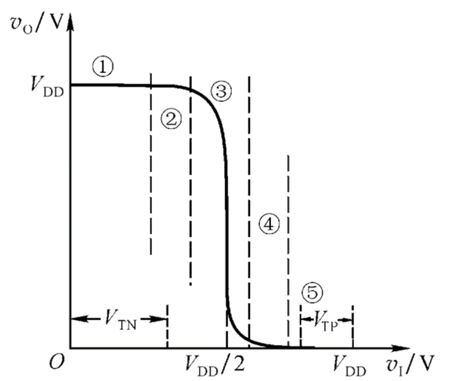{width=50%}
3. 由于MOS管的输入电流≈0,所以CMOS门电路的扇出系数极大,大于4000
4. CMOS门由于互补两管中总有一只导电,另一管截止，因此CMOS门电路的功耗极微

输入端特性

1. CMOS门电路的输入端不能悬空
2. CMOS门电路输入端接电阻相当于接低电平
    电阻R上没有电压，所以输入电压为0， 相当于输入端直接接地

{width=50%}

---

CMOS门端丽除了推拉式,漏极开路(OD门),三态门之外，还有一种传输门结构

它由NMOS和PMOS管并联而成,输入电压vI的范围为0～VDD之间.

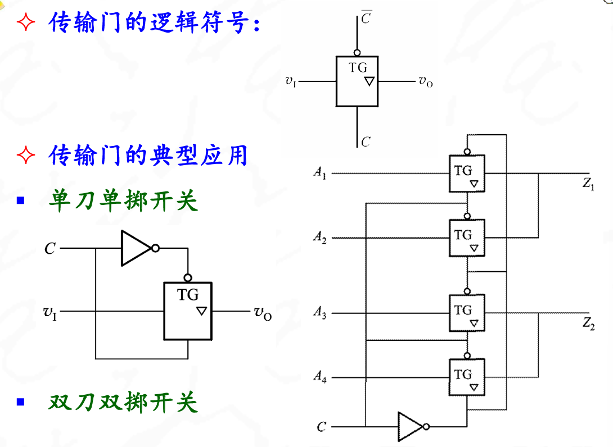

相当于是一个可控的控制开关,用一个倒三角表示是一个三态输出形式

约定场效应管的工作电源还是5v

---

??? note 例题
    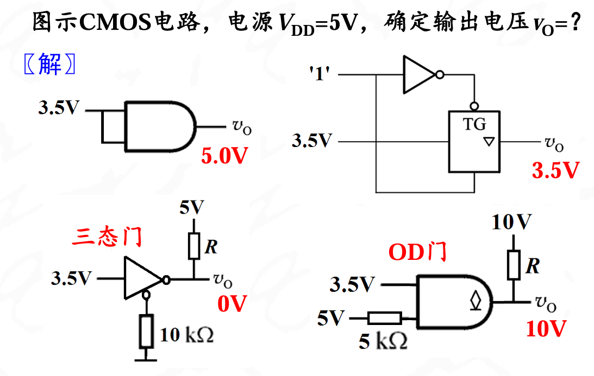

??? note 例题
    

---

## 锁存器和触发器

这两个是基本记忆单元电路,能为后面的组合电路和时序电路打下基础

---

**锁存器**:基本RS锁存器

>Q和Q非相互交叉连接,所以两者一定为互补输出

与非门组成的RS触发器:

{width=50%}

{width=50%}

| $\overline{R}$ | \overline{S} | Q     |
|---|---|-------|
| 1 | 0 | 1     |
| 0 | 1 | 0     |
| 1 | 1 | 保持  |
| 0 | 0 | 禁用  |

RS锁存器是在上升沿触发
{width=50%}

>基本RS锁存器除用与非门实现以外,还可以用或非门和与-或-非逻辑门电路实现

>不同的RS锁存器的真值表不同

---

RS锁存器小总结:

1. S和R不能同时作用(约束条件)
2. Q和$\overline{Q}$总是互补
3. 输出只有两个稳定的状态,因此具有记忆功能
4. 从一个温台到另外一个稳态,需要输入端加上输入信号激励,S作用时,Q=1;R作用时,Q=0;S,R都不作用时,Q维持不变
5. 输入信号直接触发(也称为异步触发)

RS锁存器可以实现无弹跳开关

{width=50%}

---

同步锁存器

>基本RS触发器有直接置“0”和置“1”和状态“保持”功能，但没有时钟控制，因此不能实现多同类锁存器同步工作，而且抗干扰能力差等

在时序逻辑电路中，一般要求用一个统一的时钟(CP, Clock Pulse)信号来协调整个电路的工作

带时钟的锁存器称为同步锁存器、或门控锁存器.同步锁存器只有在时钟信号的作用下，电路的输出状态才有可能翻转；没有时钟信号作用时，电路的输出状态就不变。

---

**同步RS锁存器**:

在基本RS锁存器的基础上增加了两个与非门

{width=50%}

在CP作用之前触发器的状态是现态,初始态,记作$Q_n$,在CP作用后触发态变为次态,记作$Q_{n+1}$

当CP=0的时候,触发器保持不变,被封锁

当CP=1的时候输出端的状态由RS和Q决定

{width=50%}

这里RD和SD相当于是传统的RS锁存器,而CP是时钟信号,控制RS这两个的输入,使得能够成为同步锁存器

特性方程

$$Q^{n+1}=S+Q^n\overline{R}$$

约束条件:$$RS=0$$

{width=50%}

转移规律:

1. 转移到新的状态,需要激励信号
    1. 置位S=1,R=0 Q=1
    2. 复位S=0,R=1 Q=0
2. 保持原有状态,要求没有相反的激励信号
    1. 保持0,没有置位信号即可(S=0),所以此时R=1,S=1
    2. 保持1,没有复位信号即可(R=0),所以此时S=1,R=1

---

**D锁存器**:

在RS锁存器的基础上增加一个反相器,就成为D锁存器

{width=50%}

特性方程

$$Q^{n+1}=S+Q^n\overline{R}=D+Q^n\overline{\overline{D}}=D$$

说明D锁存器的次态和输入端状态相同,CP为高电平时

{width=50%}
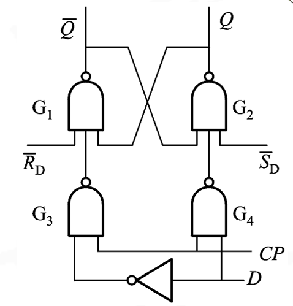{width=50%}

---

D触发器的真值表如下

$D$ | $Q^{n+1}$ | 说明
---|---|---
0 | 0 | 置0
1 | 1 | 置1

??? warning "如何提高抗干扰能力"
    在时钟脉冲CP高电平期间,外界的干扰信号会影响输入端RS或D端的状态,使锁存器的状态发生变化.这说明同步锁存器抗干扰能力较差

    ??? note "解决"
        边沿触发器只有在CP脉冲的上升沿或下降沿时接收信号，并完成翻转，而与此时刻前后的输入状态无关。所以，边沿触发器响应输入信号的时间极短，电路的可靠性高，抗干扰能力强。目前的集成触发器芯片一般都采用边沿触发方式。

---

**边沿触发的RS触发器**:

在RS锁存器的同步脉冲输入端上,增加了一个脉冲边沿检测电路,使同步脉冲的宽度变窄.

{width=50%}
脉冲边沿检测电路
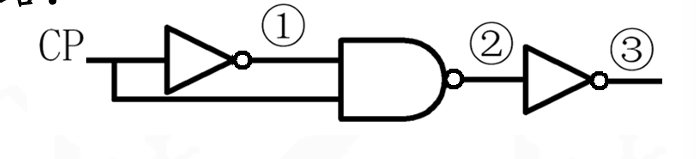{width=30%}

**主从型D触发器**:

>两个D锁存器受同一个时钟脉冲CP触发,其翻转特点是分为接收和翻转两个节拍动作

{width=50%}

关键在从触发器对CP的取反

{width=50%}

---

**维持阻塞型触发器**:

维持阻塞型触发器简称维阻触发器，通常是**上升沿(正边沿**)触发

维阻D触发器由六个与非门组成,能实现边沿触发的主要原因是电路中的四条反馈线

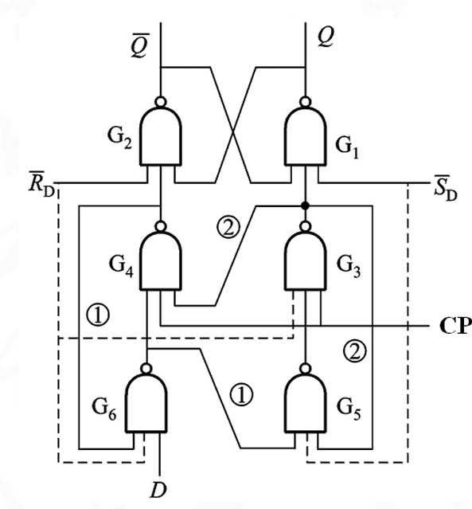{width=50%}

CP=0时,由于G3,G4门封锁,G1和G2构成基本RS触发器,因此输出状态不变
{width=50%}
在CP上升沿(CP由0变化到1)时,触发器输出按D信号翻转
{width=50%}
在CP=1期间,由于维持和阻塞作用,触发器状态不会改变
{width=50%}

{width=50%}

??? note D锁存器vsD触发器
    

??? note 注意分辨上升沿触发和下降沿出发
    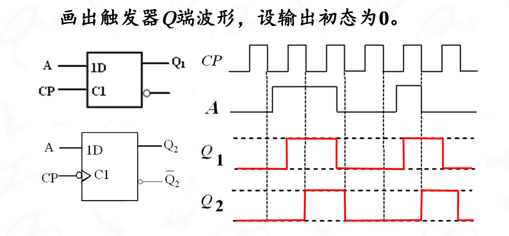

---

**下降沿JK触发器**:

该电路在CP脉冲下降沿期间接收JK信号并完成状态翻转，靠的是内部门电路延时时间差而实现的.与或非门G1,G2的传输延时比G3,G4与非门短

{width=50%}

触发方程

$$Q^{n+1}=J\overline{Q^n}+\overline{K}Q^n$$

{width=50%}

JK触发器具备有保持,置0,置1,翻转4种功能,是一个全功能触发器

{width=50%}

---

**翻转触发器**:

T'触发器:即每加一个触发脉冲CP,触发器状态应翻转一次,因此又称为翻转触发器
或计数触发器

{width=50%}
由RS触发器改接而成
{width=50%}
由D触发器改接而成
{width=50%}
由JK触发器改接而成
{width=50%}

T触发器:是一种可控的计数型触发器

当T＝1时,每来一个时钟脉冲CP,触发器状态翻转一次;当T=0时,触发器的状态保持不变

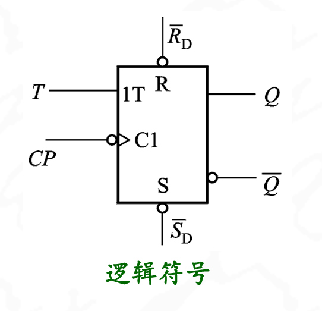{width=50%}

T | $Q^{n+1}$ | 说明
---|---|---
0 | $Q^n$ | 保持
1 | $\overline{Q^{n}}$ | 翻转

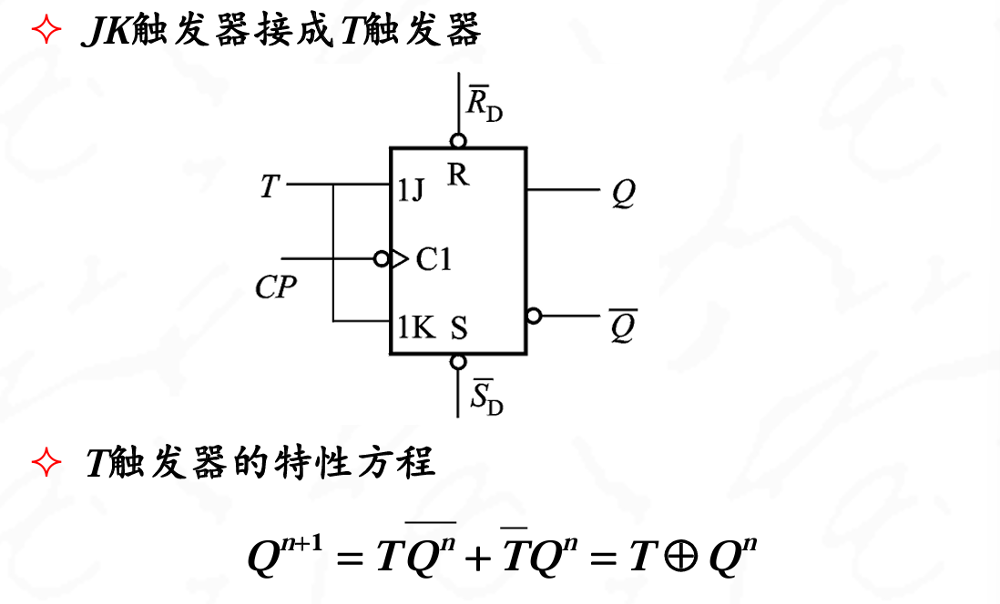

---

---

## 定时器

**单稳态触发器**:只有一个稳定状态,每当他接收触发信号之后便在输出端产生一个固定脉冲宽度的单买抽,成为暂稳态,然后回到稳定态

{width=50%}

{width=50%}

单稳态触发器的暂稳态脉冲宽带是通常由外接RC定时元件确定.

- 不可重触发单稳态触发器：输出状态处于暂稳态过程中不响应任何再次触发，即单稳态触发器忽略暂稳态过程中的任何触发信号
- 可重触发单稳态触发器：输出状态处于暂稳态过程中也能够被再次触发，重新从零开始计时。重触发的结果是输出脉冲被展宽

{width=50%}

---

**无稳态触发器**:无稳态触发器也称为多谐振荡器，电路输出没有稳态，只有2个暂稳态，暂稳态持续时间（即高低电平宽度）由外接定时元件RC决定

无稳态触发器可由**施密特触发器**通过外接RC元件实现

??? note "施密特触发器"
    

    电压特性如下
    
    

    1. 当输入电压Vin由小增大到上限电压VTH时,输出电压从高电平跳变到低电平
    2. 当输入电压Vin由大减小到下限电压VTL时,输出电压才从低电平跳变到高电平

回差电压:VTH-VTL,反映了抗干扰能力

由施密特触发器构成的无稳态触发器:

1. 电源刚刚合上的时候:电容尚未充电.施密特触发器输入为0,输出为1;输出端通过电阻R对电容C充电
2. 电容充电:当Vin上升到VTH时,施密特触发器输出由1翻转到0;电容C的电压通过电阻R放电
3. 电容放电：当Vin下降到VTL时，施密特触发器输出又跳变到1；电容C再次充电，不断repeat

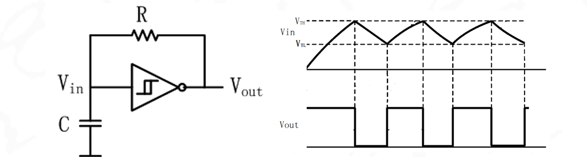{width=50%}

---
