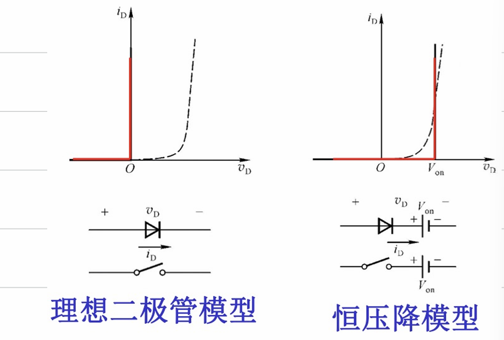
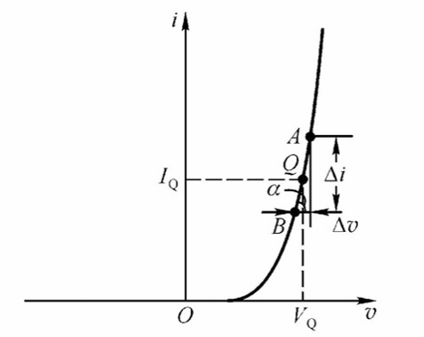
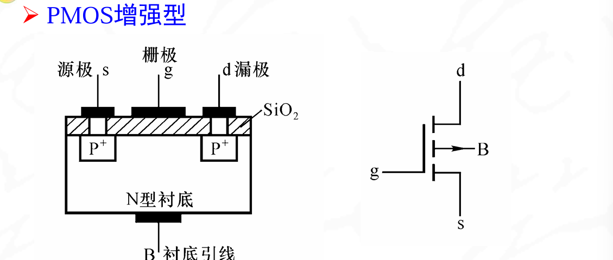
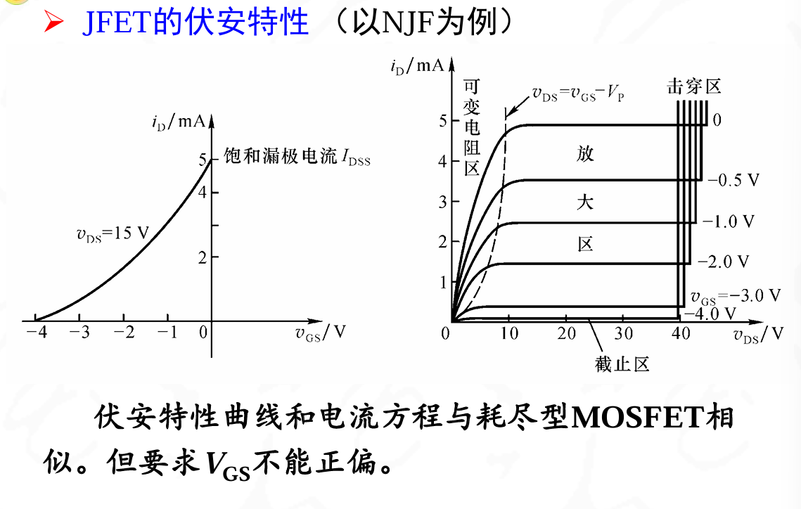

## 复习课整理

考试范围:

1. 半导体器件
2. 逻辑电路基础与卡诺图化简
3. 门电路
4. 组合逻辑电路
5. 触发器
6. 时序逻辑电路分析与设计
7. 集成计数器的功能扩展与级联
8. 555集成定时器  
9. 非正弦交流电路

---

## 半导体器件

考点:

1. 二极管的特性
    正向导通,反向截止,反向稳压
2. 导通判断
    导通电压Vt,截止电压Vc,导体电阻Rd
3. 基本应用电路
    稳压管,整流电路等
4. 稳压电路的计算
5. 三极管类型
    PNP,NPN,硅三极管,锗三极管
6. 三极管静态电压和电流的计算
7. 场效应管的类型
    N沟道,P沟道,耗尽型,增强型,能根据输出特性或者转移特性曲线来判断类型,读出参数

---

**PN结**:

>在N型半导体的基片上,采用平面扩散法等工艺,参入三价元素,形成P型区,则在P区和N区之间的交界处形成一个很薄的空间电荷层,称为PN结。

本质上是电子和空穴的结合,可是看做是正负电荷相互抵消之后剩下的电荷形成了电场.内电场组一直了多子的扩散运动,促进了少子的漂移运动,直到达到动态平衡的状态

具有单向导电性,正向导通,反向截止.

原因:

1. 正偏的时候,是P接高电压,N接低电压(记住PN结,电流方向是从P到N),这样和内电场的方向相反,PN结变薄,扩散运动增强,导通
2. 反偏的时候,是N接高电压,P接低电压,PN结变厚,扩散运动减弱,截止.此时存在少子漂移电流,也就是反向导通电流

>少子浓度和外加电压无关,反向饱和电流和温度有关

PN结的伏安特性

$$i = I_s(e^{\frac{v}{v_t}}-1)$$

1. Is是反向饱和电流,和温度有关,温度升高10度,Is增加一倍
2. Vt:是电压当量,在室温下位26mv

>PN结正向电压具有负温度系数,也就是随着温度升高而减小.
>PN结还具有电容效应

{width=50%}

---

**二极管的模型**:

1. 大信号模型:
    1. 理想二极管模型:正向直接导通,$i_d$为任意值,反向截止,$i_{od}$为0
    2. 恒压降模型:正向导通,当$V_{th} \geq V_{on}$时,二级管开启$$i_d$为任意值.反向截止,$i_{od}$为0
    
2. 小信号模型:
    当二极管在某一个工作点附近电压或者电流变化时的模型称为小信号模型:
    存在$r_d$作为动态电阻

>动态电阻的大小和微变等效电阻有关

具体公式可以有PN结特性方程求导得到$$r_d = \frac{26mv}{I_{DQ(mA)}}$$

---

**二极管的种类**:

按照材质分:硅二极管和锗二极管

由于二极管电路一般不是线性的,所以需要用图解法来求解二极管两端电压$V$和电流$I$

---

**二极管的实际应用**:

- **整流电路**

整流又可以分为半波整流和全波整流:

- 半波整流:只有一个二极管,只有正半周的波形

此时输出的电压为原来的$\frac{\sqrt{2}}{\pi}V \approx 0.45V$
由图可得,二极管承受的最大反向电压为$V_{RM} = 1.41V$

- 全波整流:有两个二极管,有正半周和负半周的波形

此时输出的电压为原来的$\frac{2\sqrt{2}}{\pi}V \approx 0.9V$

由图可得,二极管承受的最大反向电压为$V_{RM} = 2.82V,也就是$2\sqrt{2}V$

>这里学了之后可以拿捏大物实验的组装整流器

- **限幅电路**

1. 当二极管两端电压小于开启电压的时候,都处于截止状态,此时输出电压随着交流电压升高而升高

2. 当二极管电压大于开启电压的时候,二极管处于导通状态,输出电压为开启电压

- **与门电路**

{width=50%}

只有在AB都是高电平3v输入的时候,Vo的输出才是高电平,形成了与逻辑

**稳压管**

利用反向击穿特性,当通过稳压管的电流为规定的电流$I_z$的时候,稳压管的输出电压为两端电压正好就是稳压管的击穿电压

动态电阻越小,击穿特性曲线越陡峭,电压变化越小,所以此时稳压特性越好

---

**晶体管**:

采用两个PN结,主要部分有三个:集电极,基极,发射级

图中是一个NPN型的三极管.

三极管的特点是:

1. e区掺杂浓度,也就是发射级连接的区域掺杂浓度最高
2. b区域最薄,基极连接的地方最薄
3. c结面积大,也及时集电极和基区形成的PN结面积最大

在实际工作中,基区流入电路,发射极流出电流,集电极流入电流.

在三极管的表示中,箭头方向表示了发射级正偏时的电流方向.NPN型是从B流入电流

PNP型三极管则是,当发射结正偏的时候,从E流入电路,经过b和c流出

发射结正偏的时候$V_{BE}<0$,此时为pnp型三极管,反之为npn型三极管

---

**怎么判断三极管的类型**:

根据电路图判断三极管的类型,一般有这么几种类型

1. PNP型三极管:
2. NPN型三极管:
3. 硅三极管:
4. 锗三极管:

上面已经讲了怎判断PNP还是NPN,下面讲怎么判断硅还是锗

1. **工作电压**
   - **硅基三极管**的基极-发射极($V_{BE}$)正向偏置电压通常在 **0.7V** 左右。
   - **锗基三极管**的基极-发射极($V_{BE}$)正向偏置电压通常在 **0.3V** 左右。
   因此,通过测量基极和发射极之间的电压,如果约为0.7V,则很可能是硅基三极管,如果是0.3V左右，则可能是锗基三极管。

2. **型号和规格**
    在命名的时候,第二个字母,AB是锗,CD是硅

---

**BJT三极管的电路组态**:

共基极CB,共发射级CE,共集电极CG

1. C不作为输入端,B不作为输出端
2. BJT工作在放大状态时,发射结正偏,集电结反偏($V_{BE}>0,V_{CE}>0$)

首先明确三极管内电流分配关系:

!!! Warning "电流分配关系一定要搞清楚"

三极管正偏的时候,电压基本如图所示

此时可以看到,三极管的电流分配关系为:

$$I_E = I_B + I_C$$

以下是内部分配

$$I_C=I_{CN}+I_{CBO}$$

$$I_E=I_{EN}=I_B+I_{CN}$$

$$I_B=I_{BN}=I_{CBO}$$

其中$$I_{CBO}$$称为集电结反向饱和电流，其值很小，常可忽
略。

==共基组态的电流关系==

存在直流电流放大系数$\overline{\alpha}$

其中$$\overline{\alpha} = \frac{I_c-I_{CBO}}{I_E}$$,大小在0.95-0.995之间,可以看做是$I_E$控制了$I_c$

==共发射组态的电流关系==

此时可以看做是$I_B$控制了$I_C$

此时电流由关系$$\overline{\beta}=\frac{I_{CN}}{I_{BN}}\approx\frac{I_C}{I_B}$$

此时$\overline{\beta}$成为共射极电流的方法系数,大小在20-200之间

==共集电组态的电流关系==
  
此时,还是存在$I_B$对$I_C$,的控制,$$I_E=(1+\overline{\beta})I_B+I_{CEO}\approx(1+\overline{\beta}I_B)$$

!!! note "三极管不论哪种组态,都具有电流控制作用"

---

**三极管的四种工作状态**:

- 放大状态:此时发射结正偏,集电结反偏:

$$I_E=I_B+I_C$$

此时三极管的三端的压降关系为:

>BE之间压降是0.7v

- 截止工作状态:

此时发射结反偏,集电结反偏.两端压降

>此时两端都是反偏,可以把PN结看做一个二极管,压降就是二极管的反向稳压电压

- 饱和工作状态:

发射结正偏,集电结正偏

>两端压降都是0.7v

- 倒置工作状态:

发射结反偏,集电结正偏

>BC两端压降为0.7v

倒置工作状态应用较少

---

**三极管的伏安特性**:

分为三类:共射极,共基极,共集极

- 共射极:

此时基区电流$I_B$与发射结电压$V_{BE}$的关系为:

$$I_B=f(V_{BE})|_{V_{CE}=const}$$

此时和PN结正向伏安特性曲线类型.当$V_{CE}在0-1v之间的时候,随着$V_{CE}$电压的升高,在$V_{BE}$保持不变的情况下,$I_B$电流逐渐降低(曲线右移).当$V_{CE}>1$的时候,输入伏安特性基本不变

{:height="50%" width="50%"}

集电极电流$I_C$与集电极-发射级之间电压$V_{CE}$的关系

$$I_C=f(V_{CE})|_{V_{B}=const}$$

随着$I_B$的增大,伏安特性曲线逐渐升高

输出特性曲线也分为三类:截止区,饱和区和放大区

{:height="50%" width="50%"}

!!! 如何分辨截止区,放大区和饱和区
    截止区VCE变化的时候,ic基本保持不变,且此时IC很小,IB基本为0
    放大区在VCE变化的时候,Ic基本保持不变,此时IC收到IB控制
    饱和区意思是当集电极电流达到了最大值,不能再被IB增大,所以刚开始的IC曲线特别陡峭.此时基极电压也超过了饱和电压,三极管整体达到了饱和状态

注意三极管有三个极限参数,,集电极最大允许功耗,反向击穿电压,集电极最大允许电流,可以在输出特性曲线上画出安全工作区

温度上升的时候,发射结电压下降(负温度属性),温度系数大概在-2.5mv/度

输出特性：温度上升时，输出特性曲线上移，间
距增大。
{:height="50%" width="50%"}

---

**三极管的模型应用**:

- *放大状态*

此时发射结正偏,集电结反偏,$I_B>0$,$V_{CE}>0.7v$

特征是$I_C$仅仅受到$I_B$控制,且与$V_{CE}$的大小无关,具有恒流特性

等效于一个恒流源和一个反向的0.7v电压源

- *饱和状态*

特点是,若增大$I_B$,此时$I_C$基本不变,三极管失去了放大能力

等效电路如下:

{:height="50%" width="50%"}

此时$V_{BE}$之间还存在0.7v的压降.IC基本不受IB控制.

因为本来是一种放大状态,此时Vce大于0.7V.

此时基极电压VB上升,把E的电压相应的抬了上来,直到$V_{CES}=0.7v$的时候达到了临界饱和的状态

然后VB继续上升,直到直到VCES≈0.3V 时才结束,达到深度饱和

!!! 如何判断一个三极管是否饱和
    1. 三极管导通的时候如果$V_{CE}$小于0.7V(NPN),或者大于-0.7V(PNP),那么三极管处在饱和状态
    2. 先计算三极管在饱和的时候,$V_{CE}=0.7v$的时候,此时集电极临界饱和电流为$I_{CS}$,倒推出基极玲姐饱和电压$I_{BS}$.如果基极实际电流大于$I_{BS}$,那么三极管处在饱和状态

- *截止状态*

此时发射结反偏,集电结反偏,$V_{BE}<V_{th}$,硅0.5v,锗0.1v

特点是电流全部为0

---

判断三极管的工作状态

!!! warning "答案"
    1. 饱和状态:BE正偏,BC反偏且CE电压差在0.7v之内
    2. 放大状态:BE正偏,BC反偏,且CE电压差在0.7v之外(这个可能是一个锗管)
    3. 截止:两个都反偏
    4. 损坏:BE开路
    5. 临界饱和:be正偏,bc反偏,且CE电压差在0.6v之等于BE的压降,接近临界值
    6. 损坏:BC开路

---

!!! tips "思路"
    可以先根据没有电流的电压大小来初步判断工作状态,也可以假设一个状态,然后计算出来看看是否符合

这道题三个状态分别是放大,饱和截止.

---

**场效应管**:
场效应也称为场效应晶体管或场效应三极管,用FET表示,具有输入电阻高,热稳定性好,工艺简单易于集成等优点

分类:

1. 绝缘栅型场效应管:MOS管
    - 增强型MOS管
    - 耗尽型MOS管
    - 每一种都可以分为N沟道和P沟道
2. 结型JFET:本质上是耗尽管,分为N沟道和P沟道两种

---

**绝缘栅型**:MOSFET管

{:height="50%" width="50%"}

{:height="50%" width="50%"}
组成:

1. s: Source 源极
2. d: Drain漏极
3. g: Gate 栅极
4. b: Base 衬底

>PMOS与NMOS的工作原理完全相同，只是电流和电压方向不同

!!! note "箭头方向代表实际电流方向"

---

**增强型MOS管的工作原理**:

1. $V_{GS} = 0$,$V_{DS}$较小时,此时看做两个背向的PN结$I_D$ = 0

2. $V_{GS} \geq 0$表面形成了耗尽层

当$v_{GS}$增强到足够大：耗尽层下移，因为$V_B = V_S = 0v$,栅极$V_g$存在电压.栅极与衬底之间产生一个垂直电场:方向为由栅极指向衬底

它使漏-源之间的P型硅表面感应出==电子层/反型层==使两个N+区连通，形成N型导电沟道

为什么不是直接导通呢,因为二氧化硅在,无法导电,只能电场产生反型层

**开始形成导电沟道所需的最小电压**称为**开启电压**$V_{GS(th)}$(习惯上常表示为$V_T$)

开启导电沟道之后,就是NMOS管对$i_D$的控制作用发挥的时候了:

$V_{gs}$产生的反型层是的两个$N^+$区连通,形成N型导电沟道,$ds$之间呈现低组织的状态,所以在$V_{DS}$的作用下会产生一定的漏极电流$i_d$

这也可以理解为什么叫漏极,就是从反型层这里漏出来的

当$v_{GS}＝0$时没有导电沟道，而当$v_{GS}$ 增强到＞$V_T$时才形成沟道，**所以称为增强型MOS管**。并且$v_{GS}$越大，导电沟道越厚，等效电阻越小，$i_D$越大。

---

**$V_{DS}$对$I_d$的影响**

漏-源电压$V_{DS}$影响：由于沟道电阻的存在,$I_d$沿沟道方向所产生的电压降使沟道上的电场产生不均匀分布。近$s$端电压差较高，为$V_{GS}$；近$d$端电压差较低，为$V_{GD}＝V_{GS}-V_{DS}$，所以沟道呈楔形分布

1. 当$V_{DS}$较小时： $V_{DS}$对导电沟道的影响不大，沟道主要受$V_{GS}$控制,所以在$V_{GS}$为定值时，沟道电阻保持不变，$I_d$随$V_{DS}$增加而线性增加。
2. 当$V_{DS}$增加到$V_{GS}-V_{DS}＝V_T$时（即$V_{DS}＝V_{GS}-V_T$）：漏端沟道消失，称为“预夹断”。
3. 当$V_{DS}$再增加时（即$V_{DS}＞V_{GS}-V_T$）：$I_d$将不再增加，趋向饱和。因为$V_{DS}$再增加时，近漏端上的预夹断点向$s$极延伸，使$V_{DS}$的增加部分降落在预夹断区，以维持$i_D$的大小。

也就是说$V_{DS}$产生的电场是导致导电沟道变窄的原因,导电沟道先是成楔形,然后再不断变窄,直到预夹断,之后就是预夹断点不断向s极延伸,增加的部分降落在预夹断区以维持$I_d$,所以$I_d$达到饱和

---

**伏安特性曲线和电流方程**:

- 转移特性曲线

在一定的$V_{DS}$下,随着$V_{GS}$的增加,导电沟道越来越宽,等效电阻越来越小,所以$I_d$越来越大

有
$$I_d = f(V_{GS})\textbar_{V_{DS} = const}$$

$$I_d=I_{DO}(\frac{V_{GS}}{V_T}-1)^2$$

其中$I_{DO}$为导通电流,是$V_{GS}=2V_T$时的漏极电流
{:height="50%" width="50%"}

- 输出特性

表示漏极电流$I_d$与漏-源电压$V_{DS}$之间的关系

$$I_d = f(V_{DS})\textbar_{V_{GS} = const}$$

下面来分析一下三个区

- 可变电阻区
    管子导通,尚未预夹断:
    此时满足的条件是:
        - $$V_{DS}<V_{GS}-V_T$$
        - $$V_{GS}>V_T$$
- 放大区
    又称恒流区,此时的条件
        - $V_{DS}$小于$V_{GS}-V_T$
        - $V_{GS}$大于$V_T$
    此时$I_D$主要有$V_{GS}$控制,和$V_{DS}$无关,表现出较好的恒流特性
- 截止区
    管子不通

---

**耗尽型MOS管**:

制造过程中人为地在栅极下方的$SiO_2$绝缘层中掺入了大量的$K^+$(钾)或$Na^+$(钠)正离子

{:height="50%" width="50%"}

1. $V_{GS}=0V$时.靠正离子作用,使得P型衬底表面感应出N型反型层,将两个$N^+$区连通,形成原始的N型导电沟道
2. $V_{DS}$一定时,外加正向栅压$V_{GS}>0v$导电沟槽变厚,沟槽等效电阻下降,$i_d$增大
3. $V_{DS}$一定时,外加正向栅压$V_{GS}<0v$导电沟槽变薄,沟槽等效电阻上升,$i_d$减小
4. $V_{GS}$负到某一定制的时候$V_{GS(OFF)}$常用$V_P$表示,称为夹断电压,导电沟道消失,整个沟道被夹断,管子截止

---

**JFET管**:

- 在N区两侧扩散两个P＋区，形成两个PN结

- 两个P＋区相连，引出g极，没有衬底B极。  

- N区作为N型导电沟道，引出s极和d极

- $v_GS＝0$时，存在N型导电沟道(N型区)
- vGS＜0时，耗尽层增厚，导电沟道变薄

所以属于耗尽型FET，原理和特性与耗尽型MOS管相似。所不同的是JFET正常工作时，两个PN结必须反偏，如对N沟道JFET，要求vGS≤0

---

**场效应管的主要参数**:

1. 开启电压 VT (增强型管)
2. 夹断电压 VP (耗尽型管)
3. 饱和漏极电流 IDSS(耗尽型管) 与vGS=0相对应的恒流区漏极电流
4. 输入电阻 RGS(DC)
    因iG=0，所以输入电阻很大。JFET大于$10^7Ω$，MOS管大于$10^9Ω$

---

**正确区分每一种场效应管**:

看符号:

1. N沟道:电流从d流向s,在图中的表示就是指向中间的那根黑实线
2. P沟道:电流从s流向d,在图中就是从黑实线向外指出
3. MOS管中间是三段短实线,但是JFET管中间一段长实线

看Vgs-id图:
4. 增强型的在vgs=0的时候能不能导通,但是耗尽型的可以
5. P型的vgs是负的,而N型的vgs是正的(耗尽型)
6. P型的场效应管,vgs<0时id偏大(在图图像上面),0v在中间,vgs>0时id偏小(N型相反)

---
