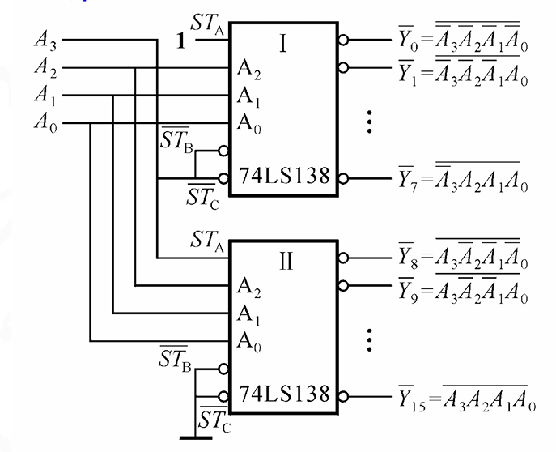
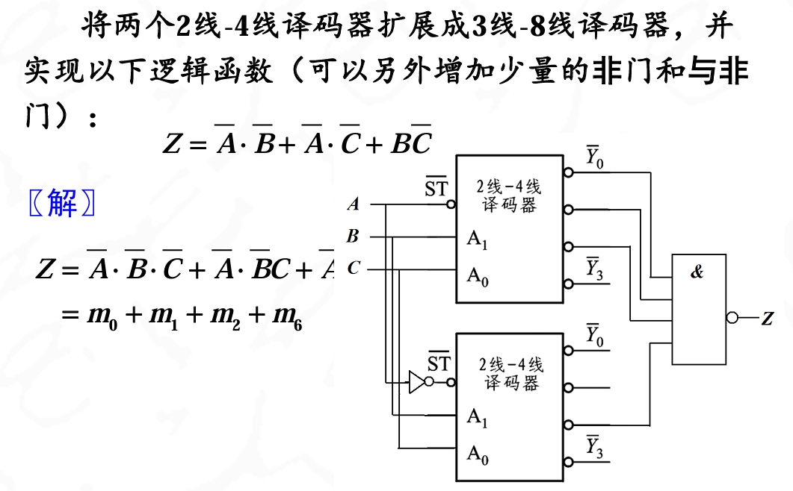
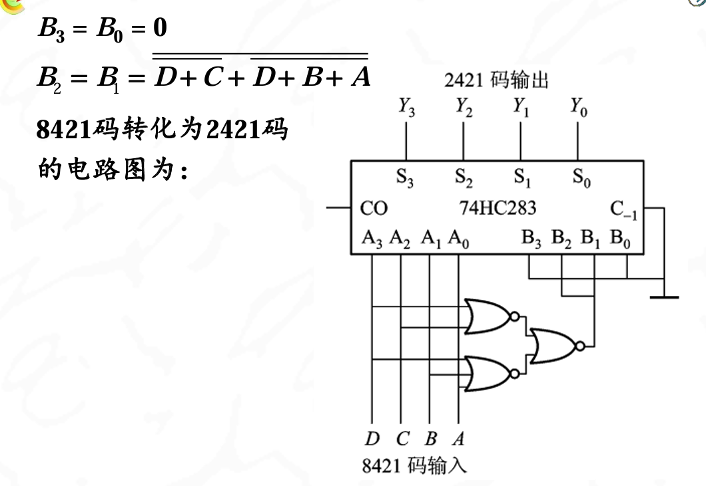
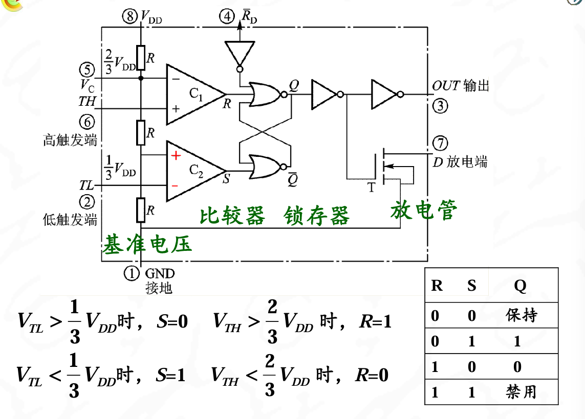

## 概述

主要讨论集成组合逻辑器件和集成时序逻辑器件

侧重于集成芯片的介绍和应用

集成组合逻辑器件主要介绍中规模集成逻辑电路,功能比较完善,除了基本功能以外还具有控制,功能扩展等

## 集成编码器和译码器

**CD4532**:8线-3线优先译码器

{width="50%"}

{width="50%"}

- 输入I7～I0为8个编码对象，Y2～Y0为编码后的3位代码输出.CD4532基本功能是8线-3线优先编码器，输出为原码输出，优先级为大数优先
- EI为该编码器的使能控制端,EI=1时使能编码器,EN=0时禁止编码器工作,输出0
- EO在EI=0,且无编码对象输入时输出1,EO与EI配合,**实现多片编码器级联**
- GS表示编码器处于工作状态。当EI=“1”，且有编码输入时才为1。用于区分编码器输出000的情况

---

功能扩展:**用两片CD4532组成的16线-4线优先编码器**

{width="50%"}
当底下那一片没有输入的时候,就是顶上的那一片的EO输入1,开始工作

---

**74HC138**：集成3线-8线译码器

{width="50%"}

- 3个输入，8个输出，低电平有效
- 3个使能端同时有效时，译码器才对输入译码

{width="50%"}

输出是低电平有效

---

功能扩展:**用两片74HC138组成的4线-16线译码器**

{width="50%"}

当A3A2A1A0为0000-0111时,需要前四位有效

当A3A2A1A0为1000-1111时,需要后四位有效

分界点在A3上,所以第2片SA接在A3,第一片not STB和not STC接在A3上

---

译码器应用2:实现组合逻辑电路

??? note "例题"
    {width="50%"}
    {width="50%"}

利用译码器的输出能转化为与或标准项的形式,再转化到输入项的方式可以很好的实现组合逻辑电路

??? note "例题"
    {width="50%"}

---

两个2线-4线译码器扩展成3线-8线译码器

最高项连在两个使能端,表示高低位的选择

??? note "例题"
    {width="50%"}

## 集成数据选择器和分配器

74HC153:集成数据选择器

74HC151:集成8选1数据选择器

具体还是看书本上的图吧

就是一种译码器,输入地址给出输出的数据通路,主要是译码器的数据输出不能选择,这个可以在D0-D8上自定义是高电平还是低电平

74HC153可以通过不同的使能端输入,变成一个8选1的数据选择器

??? note "解法"
    

---

用4片74HC151八选一数据选择器和4片74HC253四选一数据选择器实现一个32选1的数据选择电路

{width="50%"}

选两次,一此是ABC选择哪一位,另外是DE选择哪一片

---

**选择数据器应用2:实现组合逻辑函数**:

数据选择器的输出函数式是与-或表达式,采用数据选择器能够实现各种组合逻辑电路

用一片74HC151八选一数据选择器实现函数:

$$Z=f(A,B,C)=\overline{A}\overline{B}+\overline{B}C+AB\overline{C}$$

??? note "解答"
    74HC151数据选择器的输出可以表示为:
    Y=D0+D1+D2+D3+D4+D5+D6+D7
    其中D0-D7表示输入信号,Y表示输出信号,+表示与
    Z=M0+M1+M5+M6
    所以D0 D1 D5 D6=1,D2 D3 D4 D7=0
    得到电路图
    {width="50%"}

??? note "产生序列脉冲"
    {width="50%"}

    这个原理是这样的,CP作为时钟信号,过一个clk就在二进制加法器那边加上1,然后输入三位8421码到S2S1S0上,一个一个遍历I0-I7

    在Y这里输出脉冲

## 集成加法器与数值比较器

874HC283:四位二进制加法器

{width="50%"}

CO和C-1分别为进位输出和低位进位输入.

利用中规模二进制加法器，可以组成多种功能的逻辑电路

---

**加法器的应用**:

1. 多位加法,这个很若只,第四位的CO接在高四位上,要是有进位就输出一个1
2. 减法运算:

{width="50%"}

算出来的差数D是正常的表示

---

加法器应用3:实现代码转换

- 用一片74HC283将8421BCD码转化为余三码

{width="50%"}

- 用一片74HC283和或非门将8421BCD码转化为2421BCD码

老老实实话真值表写卡诺图然后得到具体关系吧

{width="60%"}
{width="60%"}
这个+1表示的是运算要求要+6这个事件为真

---

**数值比较器**:

74HC85:四位数值比较器

{width="60%"}

??? note "8位数字比较"
    {width="60%"}

## 集成时序逻辑器件

**74HC175：集成4位数码寄存器**:

{width="60%"}

**上升沿寄存数**:主要CP这里的判断

{width="60%"}

当S1第一个按下按钮的时候,G2变0,此时下降沿不会触发,直接关门不接受数据

---

**74HC194：集成4位双向移位寄存器**:

74HC194由4个RS触发器构成,MR为清零端,CP为上升沿起作用,S1S0为功能选择,DSL和DSR表示的是左移,右移之后的那个空出来的位置的电平高低

{Width="60%"}

**74HC595:移位+锁存+三态输出**:

1. SRCLR异步清零
2. SRCLK移位时钟
3. SER串行输入
4. RCLK锁存时钟
5. E三态输出控制

---

移位寄存器的应用举例:

1. 数字延迟线:n位移位寄存器产生n-1个Tcp
2. 循环序列脉冲:
3. 环形计数器:寄存器型计数器
4. 串入并出功能：发光管显示串行数据

## 集成计数器

主要要求能读懂真值（功能表）、引脚排列，就可以使用它

74HC163和74HC161：4位二进制加法计数器

>满足某种条件时，立即将计数器或触发器的状态清零，而不需要等待时钟信号的到来

74HC161是异步清零计数器，74HC163是同步清零计数器

如果用0110状态作为“反馈清零”控制，则当0110状态一出现，计数器状态就会立刻被清为0000，这使0110状态只出现短暂瞬间，计数器不是7进制，而是变成了6进制计数
因此在异步清除时，必须借助最大状态的下一个状态

## 555集成定时器

555是由模拟和数字电路巧妙结合在一起后形成的单片集成电路

该集成电路广泛地用在脉冲的产生、整形、定时和延时等方面

### 555电路结构

{width="60%"}

{Width="60%"}

功能

1. $V_{TH}$:高触发端
2. $$V_{TL}$$:低触发端
3. 3脚:输出端
4. 7脚:放电端
5. 4脚:低电平复位端
6. 5脚:电压控制端

{width="60%"}

其中$V_{TL}>\frac{1}{3}V_{DD}$时,C2比较器输出位0,S=0

$V_{TL}<\frac{1}{3}V_{DD}$时,C2比较器输出位1,S=1

$V_{TH}>\frac{2}{3}$的时候,R=1;

$V_{TH}<\frac{2}{3}$的时候,R=0;

R | S | Q
--|---|---
0 | 0 | 保持
0 | 1 | 置1
1 | 0 | 置0
1 | 1 | 禁用

6脚是高触发端,作为复位端输入,在高电平有效

2脚是低触发端,作为置位端输入,低电平有效.2脚输入0的时候S内部为1,Q置1

6脚位为高电平的时候,把Q置为0

引脚5(电压控制端)连接电容作高频旁路用 

### 555集成定时器的典型应用

1. 构成多谐振荡器

多谐振荡器的特点,只要一合上电源,电路的输出就会在高电平和低电平两个状态之间进行自动的转换,产生前后沿都很陡的矩形波

{width="60%"}

充电的t=(R1+R2)C,放电的t=R2C

555的第5引脚（即参考电压控制端）加
上控制电压VC，使比较器的基准电压可调

可以在555的第4引脚（即复位端）加调制信号，
当调制信号高电平时，电路产生高频振荡，调制信
号低电平时，不振荡，输出低电平。

占空比可调的多谐振荡器:改变R1R2

