## 基本概念

### 数值离散化

模拟信号通过分段量化,转换成离散信号或者数字信号就是数值的离散化.
在数字电路中就是二进制处理

高电平代表1,低电平代表0

### 数字电路中的数值和转换

- 二进制数值: 0,1
- 十进制数值: 0,1,2,3,4,5,6,7,8,9
- r进制:
    - r进制数的基数有r个
    - 第i位的权值是$r^{i-1}$
    - 进位规则是逢r进1

>二进制B,八进制O,十六进制H,十进制D

十进制转化成r进制的方法

1. 整数除以r取余数,余数作为该位的值
2. 小数部分乘上r取整数

### 负数的编码表示

在数字电路中用符号位表示数字的正负,此时有0表示正,1表示负.

原正负数成为**真值**

用机器数表示真值我们就需要了解三种编码

1. 原码:用于乘法
2. 反码
    1. 如果是正数:反码就是符号位加上原数值
    2. 如果是负数:符号位为1,其他位取反
3. 补码
    1. 如果是正数:补码就是原数值
    2. 如果是负数:符号位为1,其他位取反,最后加1

!!! note
    负数的补码等于反码+1

落实到具体的计算中如下

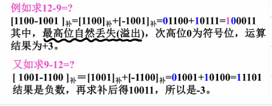

---

### 数字电路中的几种编码

**BCD码**:常见的分有权码和无权码.有权码按照每一位的权重命名,
有8421有权码,5421有权码,2321有权码

无权码则叫余三码,余一码等:余三码的意思就是
该数字转化为二进制数之后-3得到原数字.
例如0011表示原数字就是0000

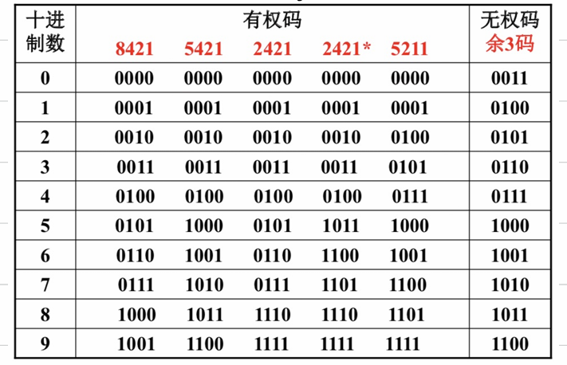{:height="50%" width="50%"}

**格雷循环码**:任何两组相邻代码之间只相差一位码不同.避免
了由于多位同时变化导致的错误

### 基本功能电路

逻辑代数的三种基本运算:与,或,非.(AND,OR,NOT)
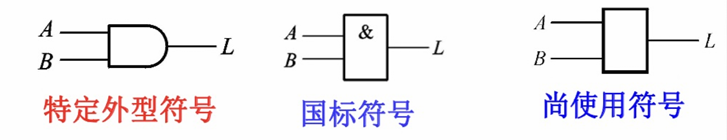
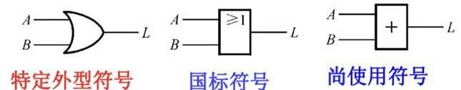
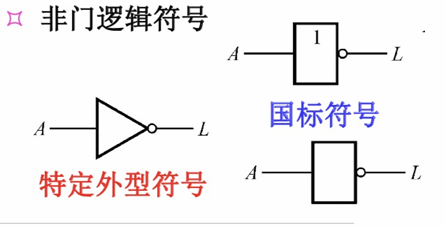

---

逻辑代数还有几种符合逻辑关系

与非(NAND)
或非(NOR)
异或(XOR)
与或非

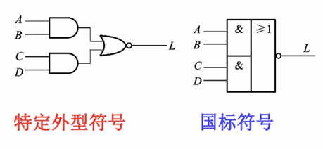

异或:
$$L=A\overline{B}+B\overline{A}$$
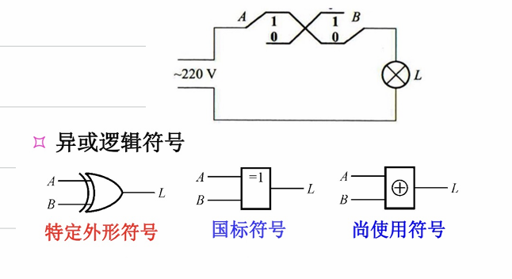

---

### 记忆逻辑功能电路

上述各种逻辑电路中，只存在从输入到输出的信号联系（开环连接），所以属于组合电路。 当电路中存在由输出反馈到输入的通路时，逻辑
电路构成了闭环连接，为时序逻辑电路。最简单的一种闭环连接方式是由两个串联的反相器构成封闭回路，称为锁存器，也称触发器

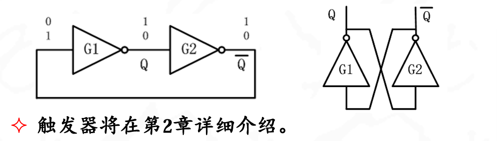

---

### 逻辑代数

又称布尔代数,就是布尔值的一些运算

#### 基本运算定理

重点掌握逻辑函数简化的方法

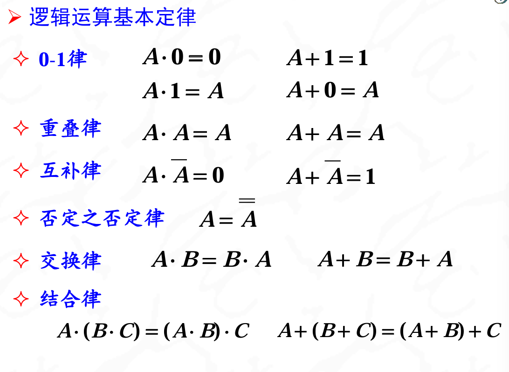
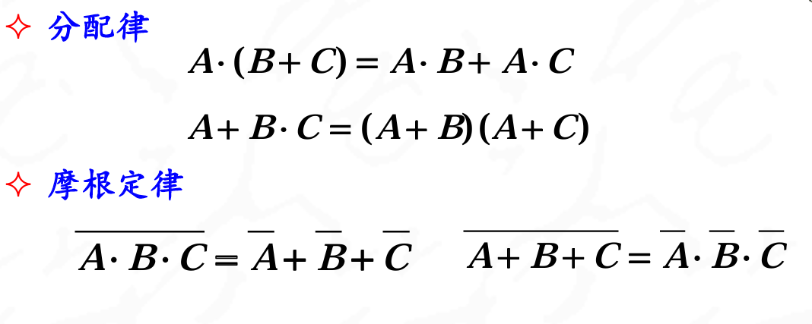

重点关注分配律和摩根定理

1. 分配律

$$A+BC=(A+B)(A+C)$$
$$(A+B)(A+C)=AB+AA+AC+BC=A(A+B+C)+BC=A+BC$$

因为(A+B+C)A=A.意思是当A为真时,括号内也为真,A为假时,括号内也为假,所以可以消除括号内的变量.

2. 摩根定理

注意拆掉上面的非的时候,下面时间不变,与变或,或变与

3. 常用公式

    1. 吸收变量: $A+AB=A$
    2. 提取变量: $AB+\overline{A}B=B$
    3. 消去多余因子:$A+\overline{A}B=A+B$
    4. 消除BC冗余项:$AB+\overline{A}C+BC=AB+\overline{A}C$

### 运算规则

1. 代入规则:
    在一个含有变量A的逻辑等式中，如果用另一个逻辑函数F去代替所有的变量，则等式仍然成立
2. 对偶规则
    将一个**逻辑表达式**中的**F的0替换成1,1替换成0**,与非再对调一下,变换之后的表达式成为F的对偶式,记作F'.
    - 若两个逻辑表达式相等，则它们的对偶式也一定相等
    - 对偶式再求一次对偶，则得到原函数
3. 反演规则
    将一个**逻辑函数**中的“0”换为“1”，“1”换为“0”，“·” 换为“+”，“+”换为“·”，**原变量换成反变量，反变量换成原变量**，则变换后的函数是原函数的反函数
    - 反演规则：若两个逻辑表达式相等，则它们的反演式也一定相等
    - 对反函数再求一次反演，则为原函数

对偶式是只把已经出现的0和1对调,而反演式是把所有的变量都换成了反的

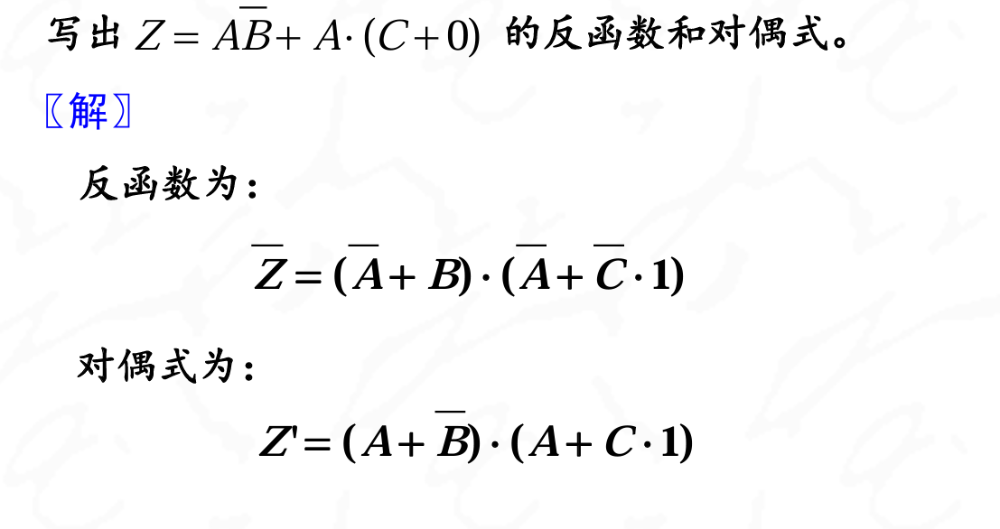

写反函数的时候可以不管顶上的取反,只需要把变量取反`+`+和`·`互换就能得到正确的答案

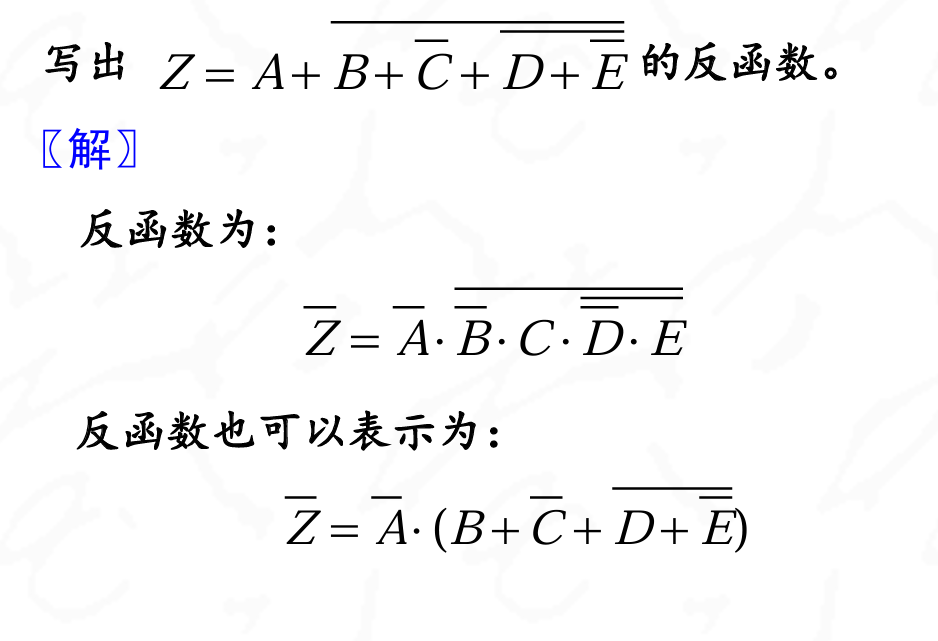

---

**逻辑问题的表达方式**:

1. 真值表
2. 逻辑表达式
    逻辑函数式的标准表达式:为标准与-或表达式,也称最小项之和表达式
3. 波形图
4. 卡诺图
5. 逻辑图

!!! note
    标准与-或表达式的每个与项都是最小项。最小项具有如下特征:
    1. 每个与项都包含了函数的所有变量A,B,C
    2. 所有变量都以原变量或者以反变量的形式出现且,仅出现一次。

---

**最小项的表示**:

最小项的下标表示,当函数`f(A,B,…)`具有n个变量时，则这个函数应有2n个最小项,最小项常用m加下标来表示，原变量用“1”、反变量用“0”赋值，则最小项用相应的下标表示

例如:
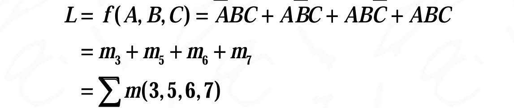

最小项的性质

1. 输入变量的任何一组取值i,只有一个最小项mi的值为1,其他最小项的值都为0
2. 任何两个最小项相与，结果一定为0
3. 全部最小项的和，结果为1。

---

**最大项之积表达式**:

最小项标准表达式求反得到的反函数就是标准或-与表达式,也称为最大项之积表达
式,每个或项都是最大项.

1. 每个或项都包含了函数的所有变量A,B,C
2. 所有变量都以原变量或者以反变量的形式出现且仅出现一次

??? note "例题"
    将以下逻辑函数化为最小项之和式(标准与-或表达式)和最大项之积形式(标准或-与表达式)
    $$L=f(A,B,C)=AB+\overline{A}\overline{B}\overline{C}$$

    ??? note "解答"
        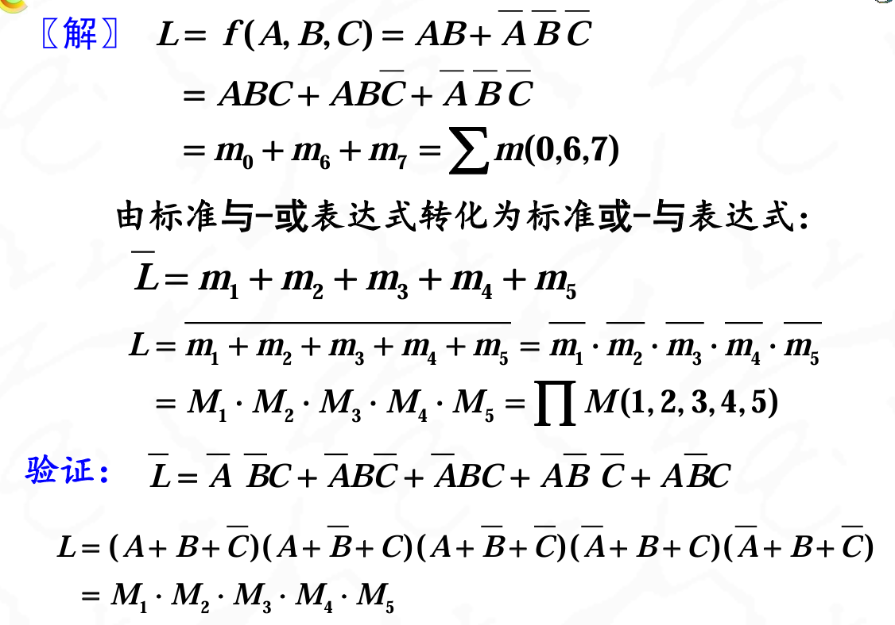

---

#### 逻辑函数化简

所谓最简的与或表达式，是指组成的逻辑电路最简（门数和每门的输入端数最少）。具体为

1. 表达式中的与项项数最少；
2. 每个与项中的变量数也最少

常用公式:
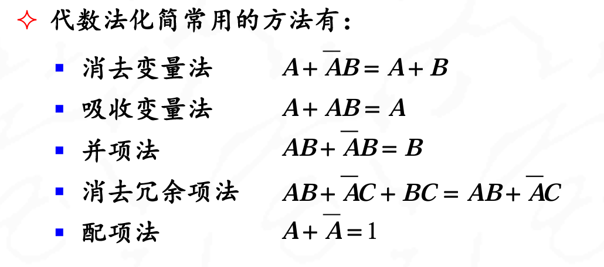

??? note "例题1:注意消去变量法的使用"
    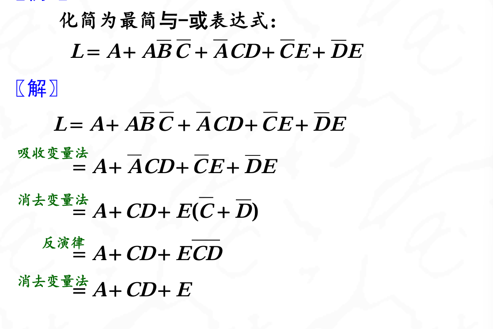

??? note "例题2:配项法"
    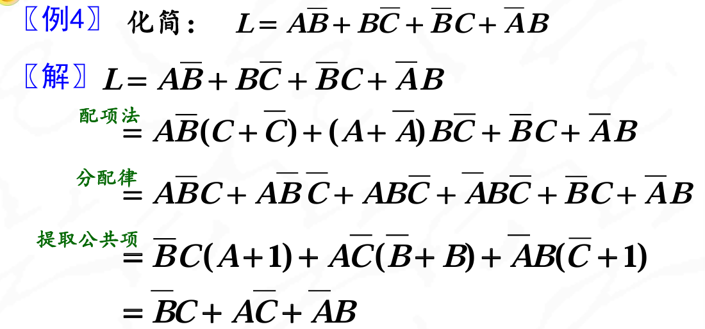

!
    $$\overline{A}\overline{B}\overline{C} \neq \overline{ABC}$$

>代数法化简需要一定的技巧以及对逻辑代数的熟练应用，无固定步骤可遵循，具有一定的试探性。对最后的化简结果，有时难以肯定是合理的。

---

#### 卡诺图化简

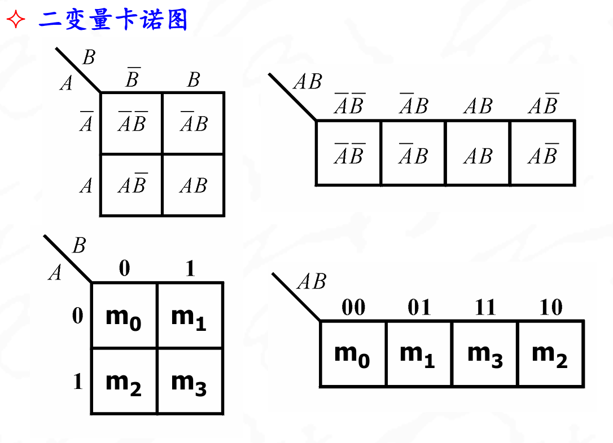{width="50%" height="50%"}

{width="50%" height="50%"}

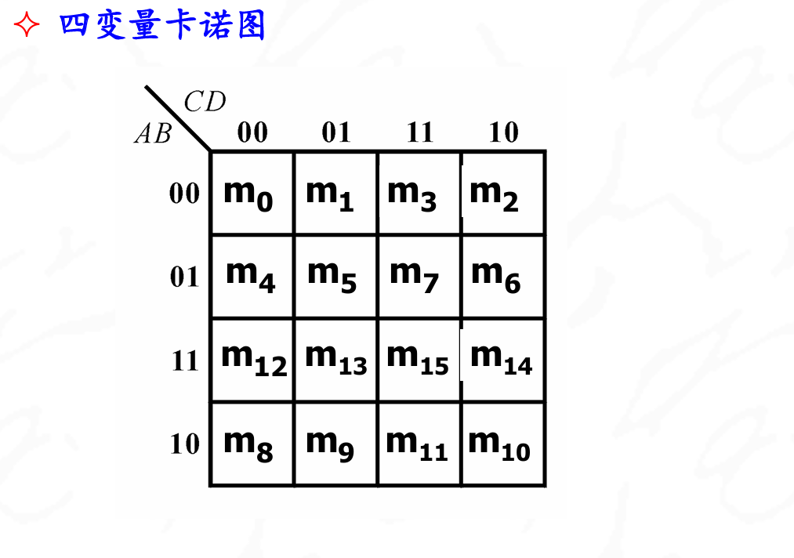{width="50%" height="50%"}

---

**用卡诺图表示逻辑函数**:

略,考后来填坑

将逻辑函数化为最简**与或**表达式、最简**与非-与非**表达式、最简**或与**表达式、最简**或非-或非**表达式、最简**与或非**表达式。

1. 包围1,得到与或表达式
2. 反演-包围1,得到与非-与非表达式
3. 包围0得到反函数的与或表达式,在反演得到最简的或与表达式
4. 再反演,得到或非-或非表达式
5. 最简与或非表达式则是通过或非-或非写出来的

!!! 卡诺图到表达式
    包围卡诺图中“1”的小方块,得到原函数的最简与-或表达式,进而反演可得到最简的与非-与非表达式.包围卡诺图中“0”的相邻小方块,得到最简的或与表达式,进而可得到最简的或非-或非表达式及与或非表达式.

充分利用约束项!

---
