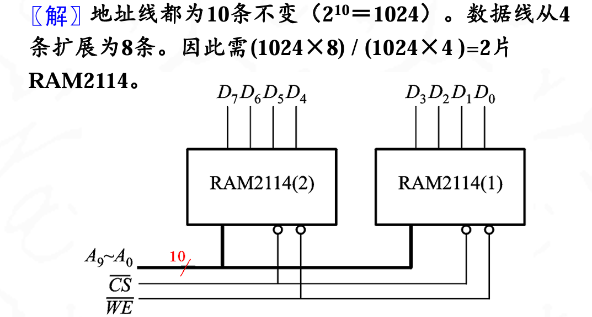
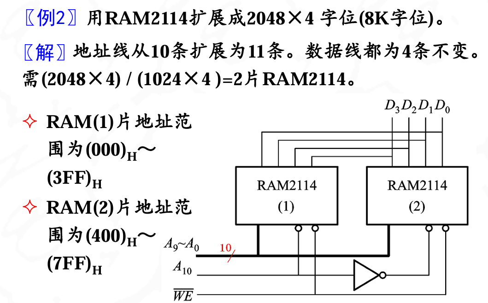

考试内容只包括了ROM和RAM的容量扩展

## 位扩展

位扩展也叫做数据线扩展

一块1024\*4的ROM芯片,要扩展成1024\*8的ROM芯片,每一个存储单元增加一倍的字长,所以叫做位扩展

??? note "原理"
    

## 字扩展

字扩展也叫做地址线扩展

一块1024\*4的ROM芯片,要扩展成为2048\*4的芯片,多了一倍的地址线,单纯的字节增加了,所以叫做字扩展

??? note "原理"
    

!!! note "注意"
    字扩展一倍地址线多一条,位扩展一倍数据线多一倍

---

*剩下的内容暂时不考*.