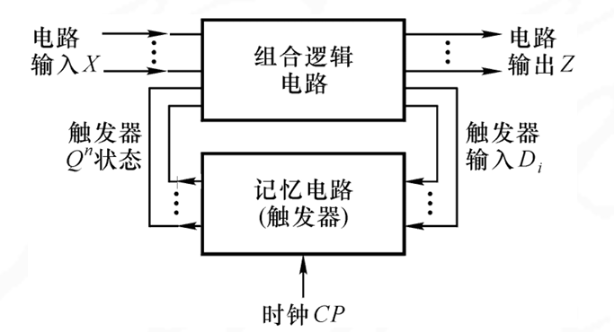
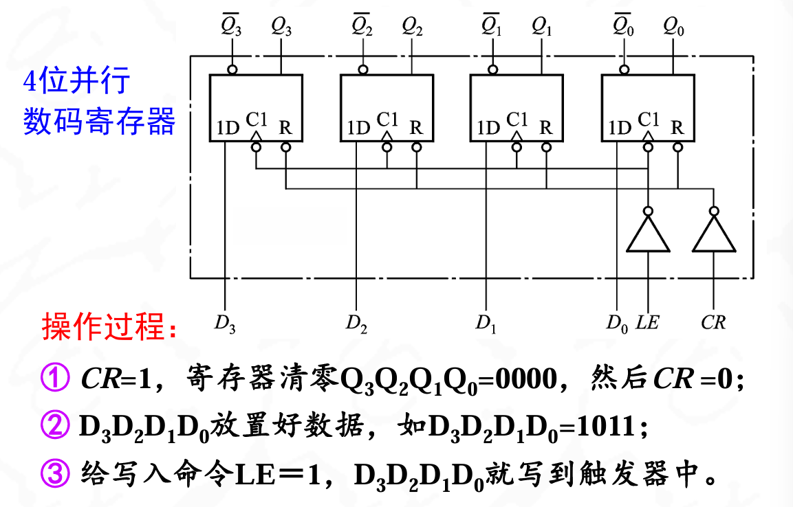
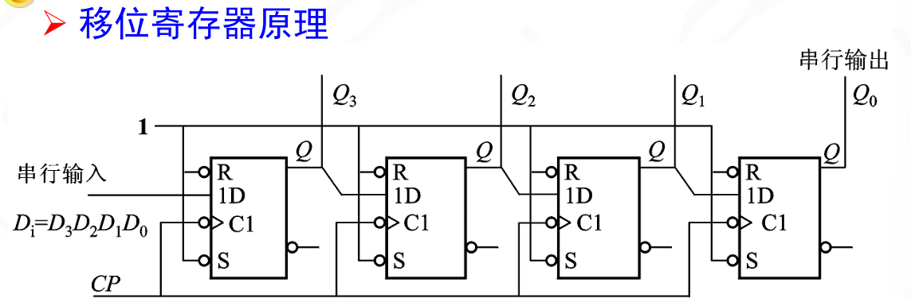
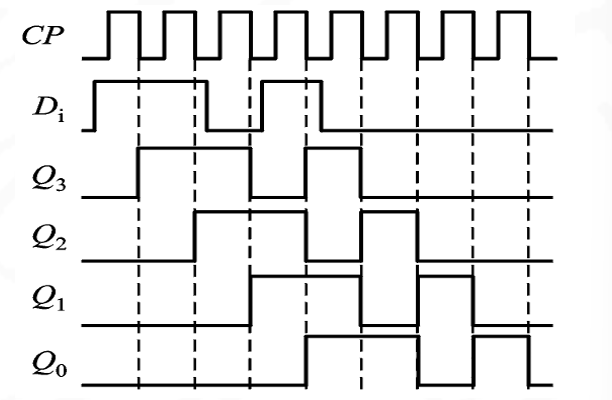
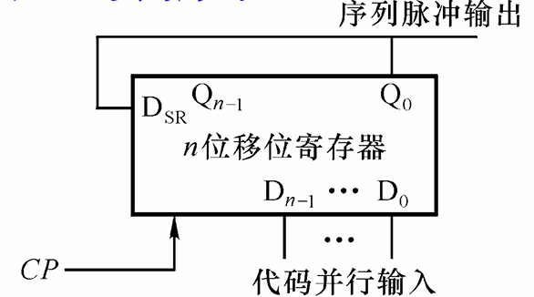
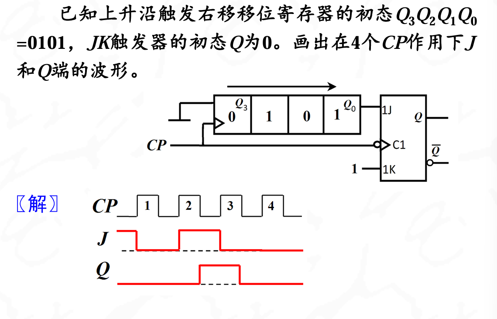
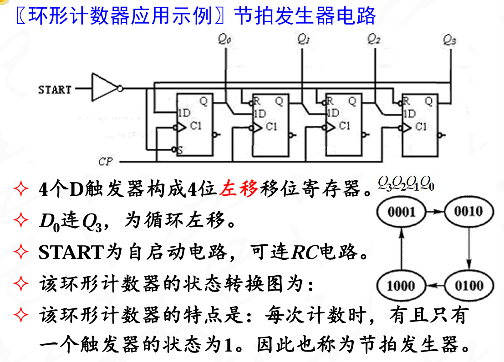
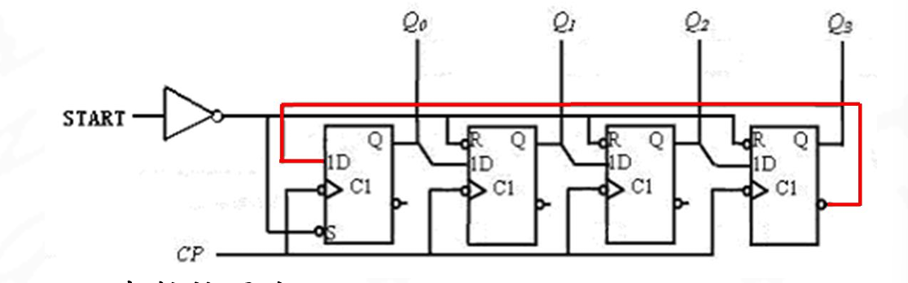

## 结构和分类

输出由输入状态和它的初始状态共同决定,一定存在具有记忆功能的逻辑元件.如触发器

{width=50%}

可以由三个方程表示

1. 驱动方程
$$D=F_1(X,Q^n)$$
2. 输出方程
$$Z=F_3(X,Q^n)$$
3. 次态方程
$$Q^{n+1}=F_2(D_i,Q^n)$$

---

**分类**:

1. 同步时序电路
2. 异步时序电路

特点

1. 时序电路触发器一般用边沿触发
2. 同步时序电路所有触发器CP连在一起,所有触发器在同意时钟边沿下工作
3. 异步时序电路中,触发器的工作有先后,肯定会产生过渡状态(毛刺),但是设计简单灵活

---

## 同步时序电路分析方法

各触发器是由同一CP触发,触发器的状态翻转将同时发生,所以分析比较简单

1. 写出各触发器的驱动方程和电路的输出方程
2. 列出完整的状态真值表
3. 状态真值表转换成状态转换图
4. 根据状态转换图总结出电路的逻辑功能

---

## 异步时序电路分析方法

异步时序逻辑电路中各触发器的CP脉冲不是同一个触发脉冲，为此各触发器不是同一时刻触发，因此分析异步时序电路时要特别注意**有无时钟脉冲**

写驱动方程的时候,直接连在CP端的不用写CP的方程,CP接在别的输入端的时候需要写出来

---

## 同步时序电路的设计方法

同步时序电路的工作速度快，但电路较复杂，设计方法比较单一；而异步时序电路电路连线简单，但工作速度慢，存在过渡态（毛刺）。一般情况下，时序逻辑电路优先考虑同步时序电路

首先需确定电路的输入和输出变量

1. 找出电路的状态转换规律是设计时序电路的关键
2. 有时需要对状态转换图进行简化
3. 得到驱动方程和输出方程后，检查自启动

---

**这块知识主要还是要写题目**:

---

## 寄存器

寄存器用来保存多位二进制信息，是电子计算机的重要组成部分，通常于保存代码或中间数据

1. N位寄存器由N个触发器（边沿触发）构成
2. 寄存器分为数码寄存器和移位寄存器

**数码寄存器**:

{width=50%}

**位移寄存器**:

保存二进制信息,实现数据的串行并行传递

对存入的信息在时钟脉冲下进行移位操作

对数据串行-并行或者并行-串行之间的转换

数据传递方式有四种: 并入并出（PIPO）(如数码寄存器), 串入串出（SISO）, 串入并出（SIPO）, 并入串出（PISO）

---

**移位寄存器原理**:

{width=50%}

先存入D0,然后每加一位数据送入cp脉冲,存入1011的时序波

{width=50%}

1. 下降沿触发送入,因为是D触发器
2. 注意看Q4先接收,然后过一个时钟Q3接收,然后Q2接收,最后Q1接收

这是串入并出的移位寄存器

---

移位寄存器应用示例:产生序列脉冲

{width=50%}

输出的脉冲又输入到Dsr的输入端,做到循环输入输出

??? note "例题"
    
    值得注意的事,在第一个上升沿之前J就已经是1的状态了

---

**移位寄存器型计数器**:

移位寄存器通过适当的反馈，就可构成移位寄存器型计数器。移位寄存器型计数器的计数状态并不反映输入脉冲的个数

1. 环形计数器:
    - 移位寄存器连接成循环位移模式
    - 自启动(初始状态,可以利用并行置数来实现)
    - 以四位移位寄存器,循环右移,初始态0111为例子.    0111->1011->1101->1110

??? note "节拍发生器"
    {width`=50%}
    每次计数时,有且只有一个触发器的状态为1。因此也称为节拍发生器
    ??? note "注意"
    1. 这里的D0接在Q3上,为循环左移.
    2. start为自启动电路,可连RC电路,实现一秒一个输入(SR使能)

??? note "扭环形计数器"
    {width=50%}
    ??? note "注意"
    1. 这里的D0接在$\overline{Q3}$上
    2. 一般是把左移移位寄存器的最高位输出Qn连至串行输入端(或右移移位寄存器的最低位输出$\overline{Qn}$连至串行输入端)

---

移位寄存器型计数器的优缺点:

1. 移位寄存器型计数器的电路结构简单,可靠性高
2. 环形计数器和扭环形计数器本身都不能够自启动,都需要合适的初始化设置
3. 在相同个数的触发器下,移位寄存器型计数器的计数长度少.如有n个触发器,二进制计数器可实现2n个状态,而环形计数器的计数长度为n,扭环形计数器的最大计数长度为2n

---
