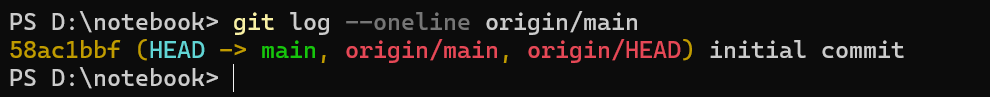
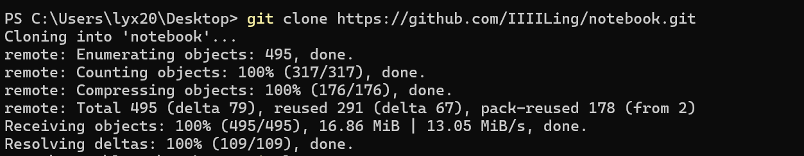

采用的思路是:

1. 创建新分支
2. 删除新分支
3. 将新分支命名为main
4. 强制推送到远程仓库

具体操作如下:

创建新分支

```bash
git checkout --orphan new-branch
```

添加文件并提交：

```bash
git add .
git commit -m "Initial commit"
```

删除旧分支（如 main）：

```bash
git branch -D main
```

重命名新分支为 main：

```bash
git branch -m main
```

强制推送到远程仓库：

```bash
git push -f origin main
```



这样远程仓库的历史记录就被清空了



此时可以看出,远程仓库的大小也变小了,说明我们已经清空了之前的历史版本